

  

  <h1>CodexHub</h1>

  
<strong>A desktop control console for Codex App SSH workspaces on Windows, macOS, and Linux.</strong>

  
Prepare Linux hosts, install or update remote Codex, apply profiles, sync skills, and inspect redacted task logs without writing to Codex App private state.

  

    <a href="docs/zh-CN/README.md">简体中文</a>
    ·
    <a href="#-install">Install</a>
    ·
    <a href="docs/macos-support.md">macOS</a>
    ·
    <a href="docs/linux-support.md">Linux</a>
    ·
    <a href="docs/known-limitations.md">Known Limitations</a>
    ·
    <a href="SECURITY.md">Security</a>
  

  

    
    
    
    
    
    
  

## 🧭 At a Glance

CodexHub is a desktop control console for one practical workflow: prepare a Windows, macOS, or Linux workstation to use Codex App across SSH-connected Linux hosts.

* Manage local OpenSSH key state and CodexHub-owned SSH aliases.
* Bootstrap new Linux hosts with a one-time password, then switch to key login.
* Probe remote Codex, config, shell, PATH, and skill state before changing anything.
* Preview and apply Codex profiles and skills with explicit confirmations and redacted logs.
* Hand the verified SSH alias back to Codex App through `Settings > Codex > Connections`.

## 🖼️ Screenshots

| View | Windows | macOS |
| --- | --- | --- |
| **Dashboard** Review every managed host at a glance, including SSH reachability, remote Codex status, profile alignment, skill inventory, and recent task results. | 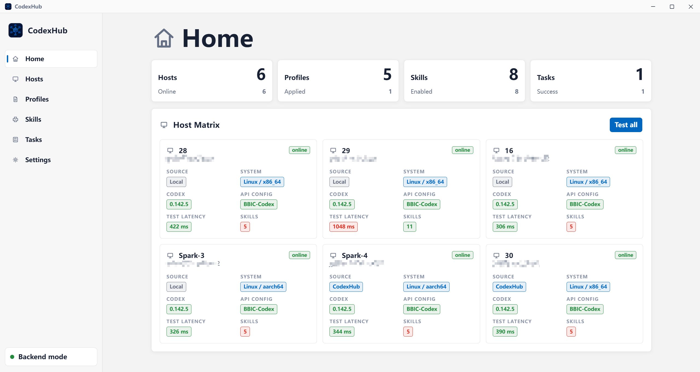 | 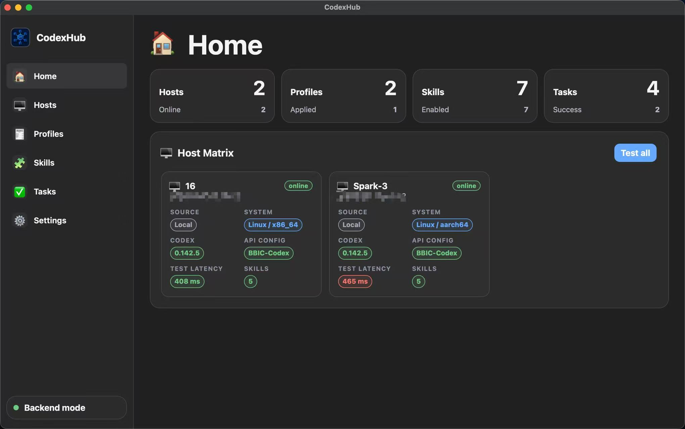 |
| **Monitor** Watch remembered hosts with page-active CPU, memory, and GPU snapshots, including refresh status and timeout evidence for slower machines. | 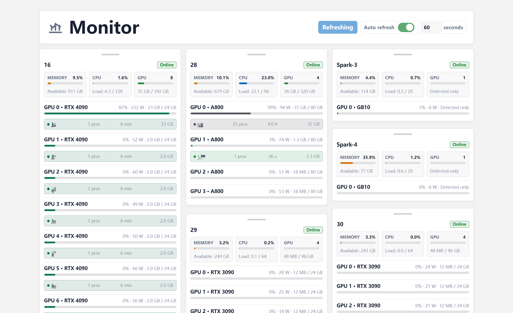 | 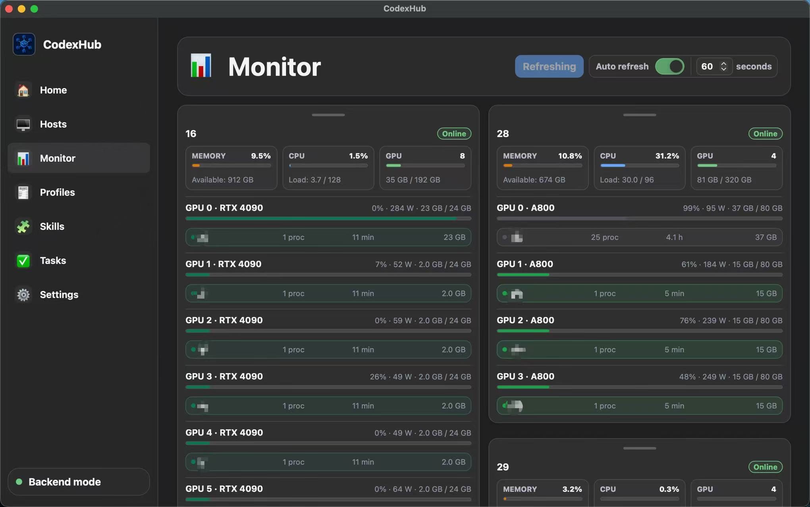 |
| **Hosts** Add or inspect SSH hosts with guided key setup, one-time password bootstrap, connection tests, and remote Codex probes. | 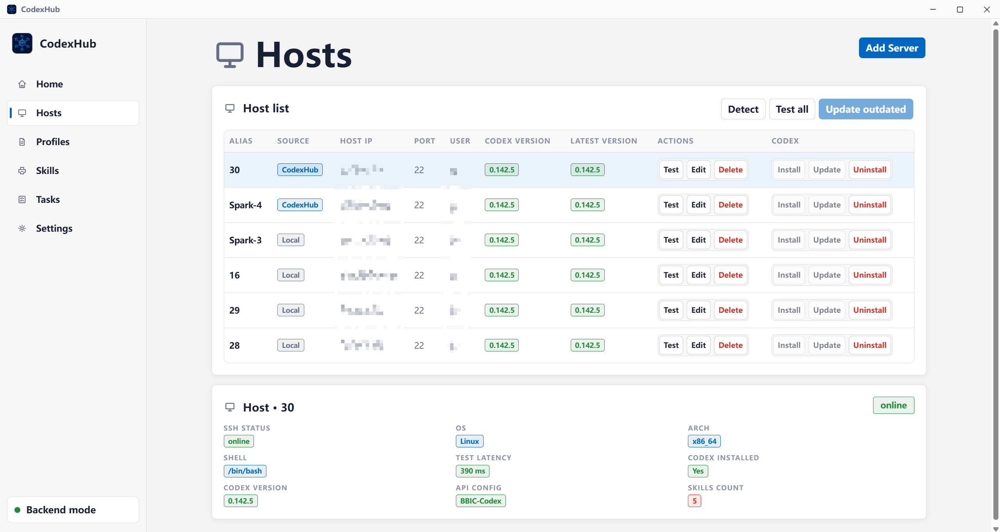 | 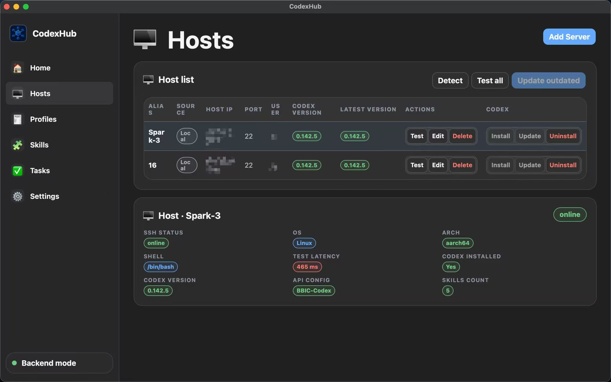 |
| **API & Profiles** Keep local API configuration names and profile templates organized before previewing or applying remote config changes. | 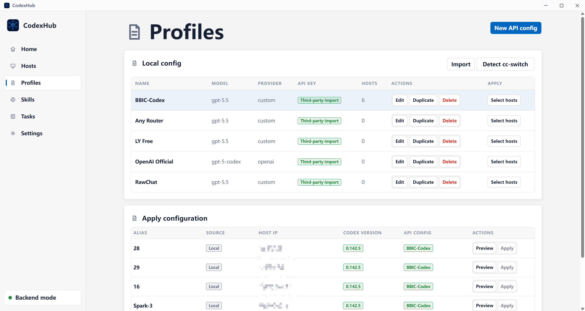 | 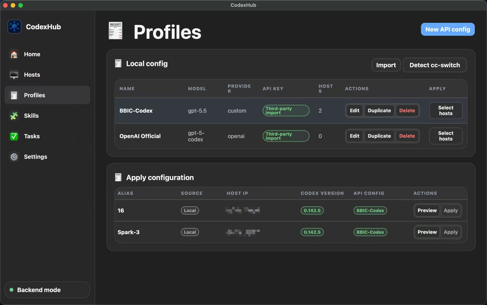 |
| **Skills** Import local or GitHub skill packs, check target inventories, preview installed skill tags, and download or remove skills with task-log evidence. | 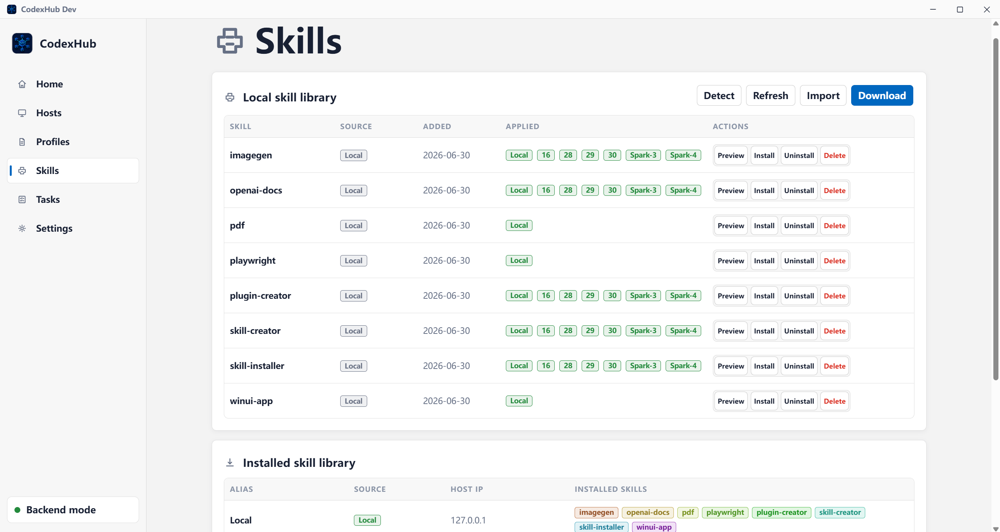 | 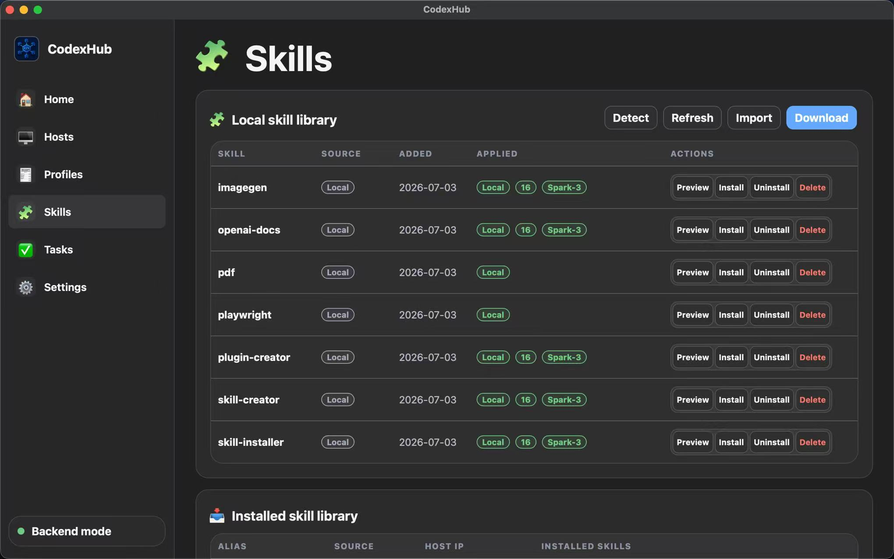 |
| **Settings** Check local SSH readiness, manage app update checks, and review platform-specific runtime preferences. | 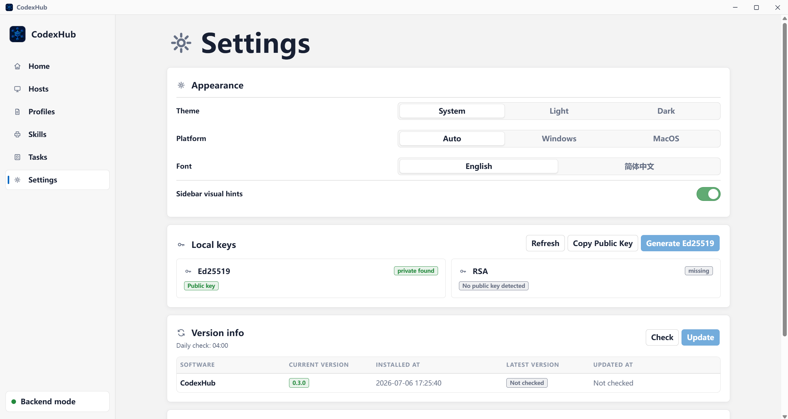 | 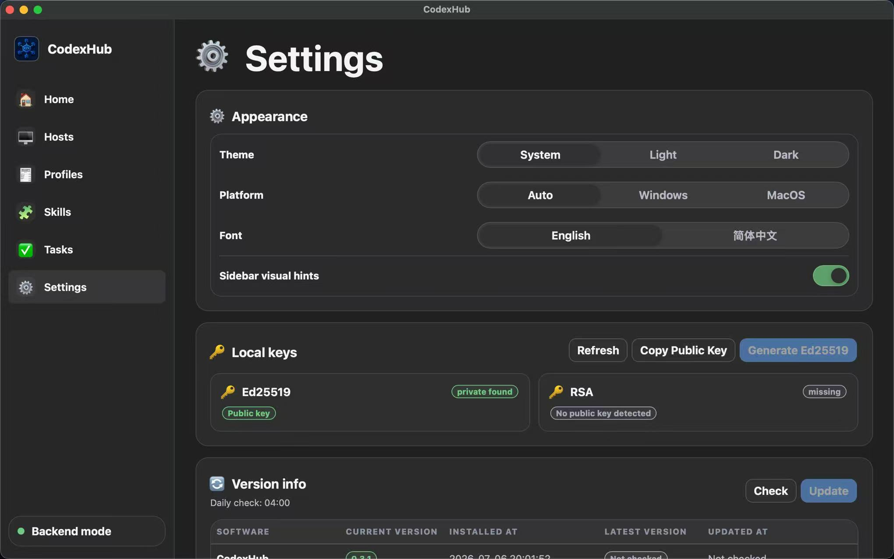 |

## ✨ Core Features

* Reads local OpenSSH status and public keys on Windows, macOS, and Linux.
* Uses a platform adapter for local SSH and Codex paths on Windows, macOS, and Linux.
* Generates a non-overwriting Ed25519 key when no suitable key exists.
* Imports safe aliases from the local SSH config in read-only mode (`%USERPROFILE%\.ssh\config` on Windows, `~/.ssh/config` on macOS/Linux).
* Adds, updates, or deletes only CodexHub-managed SSH config blocks with timestamped backups.
* Tests SSH with `ssh <HostAlias> echo ok`.
* Probes Linux remotes for OS, architecture, shell, PATH, Codex CLI, command availability, `~/.codex/config.toml`, API env readiness, and skill counts.
* Installs or updates the real remote `codex` command in the remote user's home directory.
* Manages local profile templates and applies rendered TOML to remote `~/.codex/config.toml`.
* Imports local or GitHub skill directories containing `SKILL.md`.
* Shows read-only, page-active CPU, memory, and GPU resource snapshots for remembered hosts.
* Persists the latest 100 redacted task records across restarts and keeps each retained task's complete diagnostics available on the Tasks page.
* Keeps dialogs keyboard-contained with Escape close, trigger-focus restoration, scoped live announcements, and reduced-motion support.
* Keeps a Windows tray / macOS menu bar / Linux tray status icon. The first window close asks whether future closes exit CodexHub or minimize it to the tray, and the choice can be changed later in Settings.
* Guides the user to Codex App after CodexHub verifies an SSH alias.

## 🔐 Safety Boundaries

CodexHub is designed to be conservative by default:

* It never stores SSH private keys, passphrases, one-time passwords, or OpenAI API keys in plaintext app files.
* One-time passwords and stored API keys can be revealed only by an explicit user action for verification or copying; they remain transient in the UI and are never written to browser storage or task logs.
* For SSH key material, it returns and copies public key text only.
* It does not edit unmanaged SSH config blocks.
* It writes only marked blocks between `# >>> CodexHub managed host: <alias>` and `# <<< CodexHub managed host: <alias>`.
* It does not write Codex App private files, databases, sockets, caches, or undocumented state.
* Remote Codex config uses `env_key` / `apiKeyEnvVar`. When you explicitly apply a profile with a stored key, CodexHub writes that key only to the selected host's `~/.codex-hub/env` file with restrictive permissions; remote config, metadata, and task logs stay key-free.
* Mutating remote operations use previews or explicit confirmations, scoped writes/deletes, and task-log evidence; config writes create backups when content changes.

More detail: [Security policy](SECURITY.md) and [known limitations](docs/known-limitations.md).

## ✅ Requirements

For the Windows desktop app:

1. Windows 10/11.
2. Microsoft WebView2 Runtime.
3. Windows OpenSSH client: `ssh.exe`, `scp.exe`, and `ssh-keygen.exe`.
4. SSH access to Linux remote hosts where Codex App will run.

For the macOS desktop app:

1. An Apple Silicon Mac for the public `.dmg`; use a real Mac again when validating a new local `.app` / `.dmg` build.
2. OpenSSH client tools and `ssh-keygen`.
3. Codex CLI installed through official OpenAI/Codex guidance.
4. SSH access to Linux remote hosts where Codex App will run.

For the Linux desktop app:

1. Ubuntu/Debian x86_64 or arm64.
2. OpenSSH client tools and `ssh-keygen`.
3. Codex CLI installed through official OpenAI/Codex guidance.
4. SSH access to Linux remote hosts where Codex App will run.

## 🚀 Install

For everyday use, download the latest stable build from this repository's Releases page.

* Windows: download and run `CodexHub_0.4.3_x64-setup.exe`; signed stable installers can check and install future Windows updates from Settings.
* macOS Apple Silicon: download `CodexHub_0.4.3_aarch64.dmg`, open it, and move `CodexHub.app` to Applications. The v0.4.3 macOS artifact is unsigned/ad-hoc and should be real-Mac validated before broad rollout, so macOS may require Control-click > Open or Privacy & Security approval the first time. Only trust files downloaded from this repository's Release page.
* The `.app.tar.gz` asset is for the in-app updater. macOS users should install from the `.dmg`, not by manually extracting the updater archive.
* Linux Ubuntu/Debian x86_64: install `CodexHub_0.4.3_amd64.deb`. Linux uses the macOS-style appearance by default and can be switched in Settings. Validated Linux stable builds participate in the signed updater feed.
* Linux Ubuntu/Debian arm64: install `CodexHub_0.4.3_arm64.deb`. Validated Linux stable builds participate in the signed updater feed.
* If Settings update checks fail, CodexHub opens a log dialog and records the run in Tasks for later review.

## ⚡ Quick Start

1. Open CodexHub.
2. In Settings, check Local SSH.
3. Generate an Ed25519 key only if one does not already exist.
4. Add a server with host, user, port, and identity file.
5. Use one-time password setup when the remote does not already accept your key.
6. Test the SSH alias and probe the remote host.
7. Install or update remote Codex.
8. Create a profile, preview it, then apply it to the host.
9. Import a skill and install it to local or remote targets.
10. Open Tasks to inspect redacted logs.
11. In Codex App, go to `Settings > Codex > Connections` and add or enable the verified SSH alias.

## 📘 Guided Workflows

### Add a Host

* Use Hosts > Add Server for a new CodexHub-managed alias.
* Existing aliases can be imported from local SSH config without rewriting unmanaged blocks.
* New managed hosts are written only after password login, public-key install, permission repair, and key-login verification succeed.
* First-time host keys use OpenSSH `StrictHostKeyChecking=accept-new`; changed host keys still fail.

### Install or Update Codex

* Use Profiles or Dashboard actions to run `check-version`, `install`, or `update`.
* The remote command remains `codex`; profile apply may install a CodexHub-managed `~/.local/bin/codex` launcher that sources `~/.codex-hub/env` and then execs the real Codex binary.
* Installs target `$HOME/.local/bin` and `$HOME/.codex`.
* PATH repair checks `.bashrc` or `.zshrc`, `.profile`, and existing `.bash_profile` / `.zprofile`, and adds an idempotent CodexHub-managed block only when no existing `$HOME/.local/bin` entry is present.
* Official installer is tried first; mirror and local-upload fallbacks are logged.

### Apply a Profile

* Profiles render to TOML.
* API keys are configured as environment variable references. If the profile has a stored local key, applying it writes the real value to the selected host's `~/.codex-hub/env`, adds shell source blocks with backups, and checks that the env var is available.
* Preview before applying.
* If the remote config already matches, CodexHub reports no changes and does not create a backup.
* If the file changes, CodexHub creates a timestamped backup and records the result in Tasks.

### Install Skills

* Import a local folder with `SKILL.md`, or import a GitHub repository/subdirectory URL.
* CodexHub stores a managed local copy in the app config directory.
* Target checks use cached inventory, so run detection before installing to a new host.
* Installed skill tags can be previewed. Download imports that installed directory into the local skill library; uninstall requires confirmation and permanently removes only the current target's skill directory.

## ⚠️ Known Limitations

* The v0.4.3 macOS artifact still requires real-device validation for this release, and Developer ID signing and notarization are not configured yet.
* Linux desktop packages target Ubuntu/Debian x86_64 and arm64 `.deb` first; rpm, AppImage, Snap, and Flatpak are not in scope for v0.4.3.
* CodexHub does not automatically register SSH hosts inside Codex App.
* CodexHub does not force Codex App to reconnect.
* Linux remotes are the current target; Windows remotes are not in scope.
* Full install/update depends on remote shell, `scp`, `tar`, and network or local-upload fallback behavior.
* Skill path support follows `~/.codex/skills` and `~/.codex/superpowers/skills`; project-level path drift remains a later capability.

See [docs/known-limitations.md](docs/known-limitations.md).

## 📄 License

MIT. See [LICENSE](LICENSE).

## 🤝 Community

This project actively participates in and recognizes the [linux.do community](https://linux.do/).
