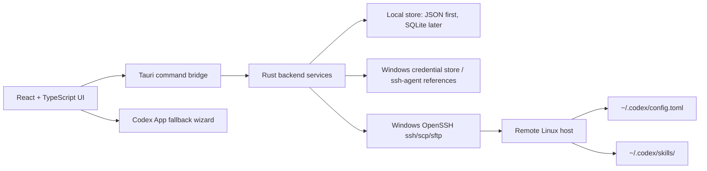

# CodexHub Architecture

Date: 2026-06-25  
Target: Windows desktop MVP using Tauri 2, React, TypeScript, Vite, and Rust.

## Architecture Principle

CodexHub is a desktop control plane for Codex App SSH-based remote development. MVP does not require a remote Codex wrapper. CodexHub connects to the user's remote Linux hosts over SSH/SFTP and directly manages remote Codex files:

- `~/.codex/config.toml`
- `~/.codex/skills/`

Codex App remains the interactive coding surface. If Codex App has no public API for host registration or reconnect, CodexHub provides a safe fallback wizard instead of touching private app state.

## Runtime Layers



## Frontend Modules

- Servers: host inventory, aliases, labels, SSH config status, connection health.
- Profiles: local profile templates and rendered remote TOML preview.
- Skills: local skill packages and remote upload/sync status.
- Operations: backup, apply, restore, dry-run, and audit log.
- Codex App Fallback: manual steps for enabling SSH hosts and reconnecting in Codex App.
- Settings: local data location, remote paths, OpenSSH binary overrides, theme, and privacy controls.

## Rust Backend Services

Planned Tauri commands:

- `app_health()`: smoke-test command exposed by the skeleton.
- `list_ssh_hosts()`: parse safe managed and unmanaged `%USERPROFILE%\.ssh\config` aliases without modifying user-owned blocks.
- `generate_ssh_host_block(input)`: produce an idempotent suggested host block.
- `append_ssh_host_block_with_backup(input)`: optional explicit write path with timestamped backup.
- `refresh_discovered_hosts()`: merge read-only local SSH aliases into the in-memory host inventory.
- `ssh_check(host_alias)`: run `ssh <HostAlias> echo ok` through system OpenSSH with timeout and redacted logs.
- `bootstrap_ssh_host(draft, password, request_id)`: use a one-time password through the Rust SSH client to log in, install the local public key, set `~/.ssh` permissions, emit four-step progress events, write only a CodexHub-managed SSH config block, then verify `ssh <HostAlias> echo ok` with system OpenSSH.
- `bootstrap_existing_ssh_host(host_alias, password)`: run the same key setup for a host already discovered in SSH config without changing unmanaged blocks.
- `remote_probe_codex(host_alias)`: check OS, arch, shell, PATH, `codex --version`, `~/.codex/config.toml`, and `~/.codex/skills`.
- `remote_read_config(server_id)`: download `~/.codex/config.toml` if present.
- `render_profile_config(profile_id)`: render TOML from structured profile state.
- `remote_apply_config(server_id, rendered_toml)`: backup, upload temp file, atomic replace.
- `remote_sync_skill(server_id, skill_id)`: validate and upload a skill folder.
- `remote_restore_backup(server_id, backup_id)`: restore a known CodexHub backup.

## Local Data Model

Initial persistence can be JSON/TOML to keep the skeleton simple. SQLite becomes useful once the UI has searchable operation history.

```ts
type Server = {
  id: string;
  name: string;
  hostAlias: string;
  hostName?: string;
  user?: string;
  port?: number;
  sshConfigManagedBlockId?: string;
  codexConfigPath: string;      // default ~/.codex/config.toml
  codexSkillRoot: string;       // default ~/.codex/skills
  createdAt: string;
  updatedAt: string;
};

type ProfileTemplate = {
  id: string;
  name: string;
  description?: string;
  config: Record<string, unknown>;
  profileTables: Record<string, Record<string, unknown>>;
};

type SkillPackage = {
  id: string;
  name: string;
  localPath: string;
  remotePath?: string;
  hasSkillMd: boolean;
};

type OperationLog = {
  id: string;
  serverId: string;
  kind: "ssh-check" | "apply-config" | "sync-skill" | "restore";
  status: "planned" | "running" | "succeeded" | "failed";
  startedAt: string;
  finishedAt?: string;
  backupPath?: string;
  message?: string;
};
```

## Remote Write Algorithm

Every remote file mutation must be previewable, backed up, and idempotent.

1. Resolve target paths with conservative shell quoting.
2. Run `mkdir -p ~/.codex ~/.codex/skills` only after explicit apply.
3. If `~/.codex/config.toml` exists, download it for diff and create `~/.codex/config.toml.codexhub.bak.<timestamp>`.
4. Upload rendered TOML to `~/.codex/config.toml.codexhub.tmp.<operation-id>`.
5. Validate that the uploaded temp file is non-empty and has the expected checksum.
6. Move temp file to `~/.codex/config.toml` on the remote host.
7. Store operation metadata and backup path locally.
8. If the rendered config is identical to the current remote config, report "no changes" and do not create a new backup.

## Profile Switching

MVP profile switching is file-based:

- CodexHub stores structured profile templates locally.
- Applying a profile renders the entire desired `~/.codex/config.toml`.
- CodexHub replaces the remote config after diff/backup.
- The user starts a new Codex session or follows the reconnect fallback in Codex App.

This avoids a remote wrapper and avoids assumptions about Codex App internals. A future wrapper can be added as an opt-in enhancement for hosts where runtime `codex --profile <name>` orchestration is desired.

## Skill Sync

MVP skill sync is folder-based:

- Validate that each local skill has `SKILL.md`.
- Copy to a temp remote directory.
- Replace only the selected skill directory under `~/.codex/skills/`.
- Back up existing remote skill directory before replacement.
- Keep the skill root configurable to handle documentation drift between `~/.codex/skills` and `.agents/skills`.

## SSH Config Policy

Default behavior is read-only analysis of `%USERPROFILE%\.ssh\config`.

Optional write behavior must follow these rules:

- Generate a diff before writing.
- Create a timestamped backup beside the original config.
- Only manage marked CodexHub blocks.
- Preserve comments and unrelated `Host` blocks.
- Never overwrite private keys or shell config.

## Credential Policy

- Do not store SSH private keys or passphrases in CodexHub data files.
- Prefer Windows OpenSSH agent, Windows credential store, or references to existing key paths.
- If a secret must be remembered later, use an OS credential store plugin/crate, not plaintext JSON.
- Operation logs must redact usernames only when requested, but always redact key material, passphrases, tokens, and private host secrets.

## Codex App Fallback UX

Because no public stable API was found for automatic host registration or forced reconnect, the MVP fallback is explicit:

1. Show the SSH alias CodexHub verified.
2. Show the exact Codex App navigation: Settings > Codex > Connections.
3. Provide copy buttons for the alias and test commands.
4. Show what CodexHub already changed on the remote host.
5. Provide rollback/restore actions for files CodexHub changed.
6. Avoid private Codex App files, databases, sockets, and undocumented IPC.

## Future Optional Wrapper

A remote wrapper is a later enhancement, not an MVP dependency. It may provide:

- Runtime profile selection without replacing the default config.
- Remote health endpoints.
- More precise Codex CLI checks.
- Remote-side atomic operations with richer validation.

Wrapper adoption must remain opt-in and must not block the direct SSH/SFTP path.
