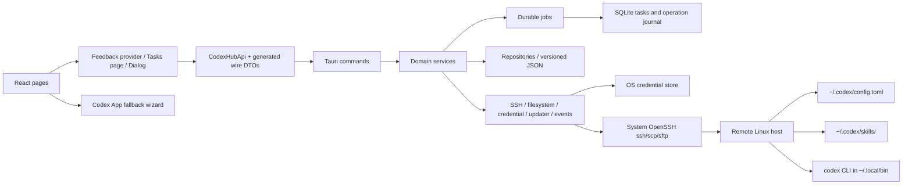

# CodexHub Architecture

Date: 2026-07-13
Target: Cross-platform desktop MVP using Tauri 2, React, TypeScript, Vite, and Rust, with Windows, macOS, and Ubuntu/Debian x86_64 plus arm64 Linux deb release-build support.

## Architecture Principle

CodexHub is a desktop control plane for Codex App SSH-based remote development. MVP does not require a remote Codex wrapper. CodexHub connects to the user's remote Linux hosts over SSH/SFTP and directly manages remote Codex files:

- `~/.codex/config.toml`
- `~/.codex/skills/`

Codex App remains the interactive coding surface. If Codex App has no public API for host registration or reconnect, CodexHub provides a safe fallback wizard instead of touching private app state.

The local platform layer owns OS-specific paths and command discovery. Windows keeps `%USERPROFILE%\.ssh\config`, while macOS and Linux use `~/.ssh/config`, `~/.ssh/id_ed25519`, `~/.codex/config.toml`, `~/.codex/skills`, and the Codex binary search order documented in `docs/macos-support.md` and `docs/linux-support.md`.

## Runtime Layers



## Frontend Modules

- Servers: host inventory, aliases, labels, SSH config status, connection health.
- Profiles: local profile templates, CRUD/import/export, env-var-first API key policy, rendered remote TOML preview, and single or selected-host batch apply.
- Skills: local skill packages, GitHub search/clone import, installed-skill tag preview/download/uninstall, remote upload/install status, and remote list.
- Operations: backup, apply, restore, dry-run, and audit log.
- Codex App Fallback: manual steps for enabling SSH hosts and reconnecting in Codex App.
- Settings: local data location, remote paths, OpenSSH binary overrides, theme, and privacy controls.

## Feedback And Accessibility

`AppErrorBoundary -> FeedbackProvider -> App` is the root composition. Every notification starts closing within five seconds and uses a one-second transition: it enters with a short upward movement plus blur-to-sharp reveal, then exits with the inverse downward blur. Pointer, keyboard, touch, wheel, or scroll input starts the exit immediately. Information, warning, success, and failure use theme-aware pale blue, yellow, green, and red surfaces with stronger semantic borders and an elevated shadow. While a host-operation progress modal is mounted, its completion Toast uses `global` placement and is centered over the full app viewport; without that modal, the same Toast uses `detail` placement and is centered over the content pane. Other notifications may still request an explicit placement. Durable writes, live SSH, remote probes, installs, updates, applies, syncs, migrations, recoveries, and partial failures still have a persistent task; form validation, copy confirmation, and pure UI actions stay transient.

The Tasks page reads the authoritative retained SQLite history and displays at most 100 task records. Host tests and remote Codex maintenance use the same `OperationProgressPanel` for live progress and retained history with two disclosure levels: every durable `TaskStep`, including a failed step, starts as a collapsed summary card; opening it reveals concise log rows, and opening one log row reveals its command, exit status, duration, timeout state, stdout, and stderr. Legacy tasks without steps are presented as one synthetic history card without rewriting their stored rows. The persisted `hostOperationLogPopups` setting defaults to enabled for existing and new installations. Disabling it suppresses only automatic live progress modals for host tests and Codex install, update, uninstall, and batch update; execution, persistence, completion Toasts, and the authoritative Tasks history continue unchanged. Resource sampling uses a three-host sliding pool and emits a request-scoped transient progress event as each host finishes, so the monitor replaces that host's card immediately while the final batch result remains in configured host order. It creates a durable task only for the first monitor-page entry and explicit manual refreshes; scheduled auto-refresh updates the cards without writing task history. Sidebar success and failure dots use the same transient completion state and clear when the user enters or interacts with the owning page; durable failures remain available in Tasks without pinning a sidebar indicator.

All app modals use shared Radix Dialog/AlertDialog wrappers while retaining existing CSS variables. They trap Tab/Shift+Tab, choose form or Cancel initial focus, close through the same Esc path, prevent accidental backdrop closure, block closure while a write is busy, and restore focus to the real trigger or active navigation item. Live regions are scoped to the changed message, and `prefers-reduced-motion: reduce` disables animations/transitions without hiding static busy text.

Rust wire contracts for structured errors, tasks, storage, Settings, updater status, Hosts, Profiles, Skills, SSH, resource monitoring, and profile-apply results are generated with `ts-rs` into `src/generated/rust-contracts.ts`. UI-normalized view models remain in `src/models.ts`; generated files are never edited manually.

## Rust Backend Services

The backend migration boundary is `commands -> services -> jobs -> storage/adapters`:

- `commands/` contains thin Tauri entry points only: parse wire arguments, pass `AppState` to one domain use case, and return the existing public command shape. All public command names remain stable.
- `services/` owns use-case sequencing and compensation. Hosts/SSH, Profiles/credentials, Skills, updater, related Host/Profile writes, and storage migration/restore are separated into use-case and operation modules.
- `jobs.rs` persists queued/running/final task transitions and redacts every step summary and log surface before SQLite writes. A step and its optional detail log are committed atomically before the task-update notification is emitted; monotonic merging prevents stale parallel snapshots from moving a durable running or terminal step back to pending. Failure to persist a required transition fails the command; Tauri event delivery remains diagnostic because SQLite is authoritative.
- `storage/` owns app-scoped paths, versioned JSON, atomic replacement, backup/recovery, multi-file compensation, and the SQLite `TaskStore` repository. Task schema v4 adds `task_steps` plus `task_logs.step_id`; upgrades checkpoint WAL, create and validate a `VACUUM INTO` snapshot, then migrate transactionally. Startup marks queued/running tasks as interrupted, running steps as failed, and pending steps as skipped. Task history keeps at most the latest 100 task records. Before automatic retention or manual clearing deletes completed rows, complete tasks, steps, and logs are serialized into a recovery JSON file and moved through the operating system recycle-bin API; task-level tombstones prevent stale async snapshots from restoring recycled records. Running and queued tasks are never recycled.
- `adapters/` isolates event delivery and OS credentials. Existing `ssh.rs`, `resource_monitor.rs`, and `updater.rs` remain compatibility adapters behind services.

`src-tauri/src/lib.rs` contains module wiring and shared imports only; Tauri builder/lifecycle assembly lives in `app_runtime.rs`, wire/domain types in `domain.rs`, and backend characterization tests in `backend_tests.rs`.

`AppState` contains only `Arc<AppServices>`. `AppServices` owns resolved `AppPaths`, repositories, event adapters, and in-memory read caches; JSON/SQLite remain authoritative when data is reloaded.

Tauri command surface:

The complete desktop/mock failure policy is documented in [Desktop Command Boundaries](desktop-command-boundaries.md). Desktop command failures never fall back to Mock results.

- `app_health()`: smoke-test command exposed by the desktop backend.
- `get_settings()` / `save_settings(settings)`: persist local appearance, setup-guide state, close-button behavior, and updater proxy preference.
- `detect_network_proxy()`: inspect updater proxy configuration, environment proxy variables, and common localhost proxy ports without reading proxy credentials.
- `get_local_codex_status()`: inspect the local Codex CLI path and version without installing anything.
- `get_ssh_status()`: inspect local OpenSSH state and public-key availability without reading private key contents.
- `generate_ed25519_key()`: generate a non-overwriting local Ed25519 keypair.
- `list_ssh_config_hosts()`: parse safe managed and unmanaged `%USERPROFILE%\.ssh\config` aliases without modifying user-owned blocks.
- `upsert_ssh_config_host(draft)` / `delete_ssh_config_host(alias)`: write or remove only scoped CodexHub-managed/local target blocks with backups and task evidence.
- `list_hosts()`, `refresh_discovered_hosts()`, `add_host()`, `update_host()`, `delete_host()`: manage CodexHub's durable host inventory while keeping discovery read-only.
- `test_ssh_connection(host_id)` / `ssh_check(host_alias)`: run `ssh <HostAlias> echo ok` through system OpenSSH with timeout and redacted logs.
- `bootstrap_ssh_host(draft, password, request_id)`: use a one-time password through the Rust SSH client to install the local public key, set permissions, write a managed SSH config block, and verify key login.
- `bootstrap_existing_ssh_host(host_alias, password)`: run the same key setup for a discovered host without changing unmanaged blocks.
- `remote_probe_codex(host_alias, timeout_ms, request_id)`: verify SSH, then check system, Codex, API-config, and skills groups in parallel while emitting durable step progress.
- `remote_manage_codex(host_alias, action, timeout_ms, request_id)`: run single-host `check-version`, `install`, `update`, or `uninstall` for the real remote `codex` command with ordered stages.
- `batch_remote_probe_codex(host_aliases, timeout_ms, request_id)` / `batch_remote_update_codex(host_aliases, timeout_ms, request_id)`: run user-triggered host tests or updates through a six-host sliding concurrency pool while preserving input order in the result.
- `refresh_latest_codex_version()`: refresh/cache the latest known Codex CLI version.
- `list_profiles()`, `create_profile()`, `update_profile()`, `delete_profile()`, `duplicate_profile()`, `import_profiles()`: manage local structured profile templates without exporting secret values.
- `set_profile_api_key(profile_id, api_key)`, `get_profile_api_key(profile_id)`, `delete_profile_api_key(profile_id)`: store, explicitly retrieve, or delete a local OS credential-store value while profile JSON keeps only credential state. Retrieval is used only by the profile editor's reveal control, and the value is never logged or cached.
- `detect_cc_switch_profiles()` / `import_cc_switch_profiles()`: import compatible local profile definitions without persisting credential values in profile JSON.
- `preview_profile_apply(profile_id, host_ids)`: render TOML and summarize per-host remote config actions before mutation.
- `apply_profile(profile_id, host_ids)`: backup, upload temp file, atomically replace remote config, write apply metadata, refresh host/profile state, and record redacted task logs.
- `list_local_skills()` / `list_skill_packs()`: read persisted local managed skills.
- `import_local_skill(path)`: validate `SKILL.md` at the selected directory or immediate child directories, then copy valid skills into CodexHub-managed storage.
- `update_library_skill_about(skill_id, about)`: persist a user-edited library About/details field for preview.
- `get_skill_inventory_status()`: read whether the first host skill inventory scan has completed and return remembered local/host skill lists.
- `detect_installed_skills(include_hosts, timeout_ms)`: scan local Codex skill roots and, when requested, configured host skill roots.
- `download_github_skill(repo_url, timeout_ms)`: accept direct GitHub repository URLs and `tree/<branch>/<skill-path>` subdirectory URLs, shallow clone, validate, and import valid skills.
- `get_skill_targets(skill_id, timeout_ms)`: use cached inventory to return installable/uninstallable targets for the library table.
- `install_skill_targets(skill_id, targets, timeout_ms)` / `uninstall_skill_targets(skill_id, targets, timeout_ms)`: install or remove the managed copy on selected local or host targets.
- `download_installed_skill(request, timeout_ms)` / `uninstall_installed_skill(request, timeout_ms)`: act on a cached installed-skill tag, importing that exact installed directory into the local library or permanently deleting it from the current target after explicit confirmation.
- `delete_library_skill(skill_id, uninstall_first, timeout_ms)`: remove the CodexHub library record and managed copy, optionally uninstalling known targets first.
- `list_tasks()`: compatibility read of persistent redacted history.
- `query_tasks(query)`, `get_task(task_id)`, `acknowledge_task(task_id)`, `clear_task_history()`: persistent task history, acknowledgement, and page-level clearing of all completed task records into a recoverable JSON archive in the system recycle bin.
- `record_frontend_error(message)`: persist a sanitized React failure without a stack trace or raw exception text.
- `get_storage_health()`, `preview_storage_migration(store)`, `apply_storage_migration(plan)`, `preview_storage_restore(store)`, `restore_storage_backup(plan)`: explicit fingerprinted migration and recovery workflow.

## Local Data Model

Authoritative low-frequency settings, hosts, profiles, and skill metadata use versioned JSON. Searchable task runs, steps, logs, acknowledgement, schema history, cross-file operation journals, and backup metadata use SQLite. Rebuildable Codex-version and skill-inventory data lives under the app cache directory. API key values remain only in the OS credential store.

Durable JSON v1 is `{ schemaVersion, updatedAt, data }`. Legacy arrays/objects are readable as v0, but writes remain locked until the user previews and confirms a SHA-256 fingerprinted migration. Changed writes create timestamped backups and use same-directory flush/validate/atomic replacement; unchanged writes create no backup. Corrupt data never silently falls back to a backup.

SQLite enables foreign keys, WAL, `synchronous=FULL`, and a busy timeout. Schema v4 stores ordered `TaskStep` rows and associates detailed `TaskLog` rows through optional `stepId`; old tasks load with an empty step list. Startup converges interrupted task and step states, and future schema upgrades retain the same validated-snapshot plus transactional-migration rule.

```ts
type Server = {
  id: string;
  name: string;
  hostAlias: string;
  hostName?: string;
  user?: string;
  port?: number;
  sshConfigManagedBlockId?: string;
  codexConfigPath: string;      // default ~/.codex/config.toml
  codexSkillRoot: string;       // default ~/.codex/skills
  createdAt: string;
  updatedAt: string;
};

type ProfileTemplate = {
  id: string;
  name: string;
  description?: string;
  config: Record<string, unknown>;
  profileTables: Record<string, Record<string, unknown>>;
  apiKeyEnvVar?: string;
  credentialStored: boolean;
};

type SkillPackage = {
  id: string;
  name: string;
  description: string;
  about: string;
  version: string;
  sourceType: "local" | "github" | string;
  source: string;
  originalPath?: string;
  managedPath: string;
  hasSkillMd: boolean;
  addedAt: string;
  updatedAt: string;
  applications: SkillApplication[];
};

type SkillApplication = {
  targetType: "local" | "host" | string;
  label: string;
  hostAlias?: string | null;
  path: string;
  detectedAt: string;
  hasSkillMd: boolean;
};

type SkillInventoryStatus = {
  firstHostScanCompleted: boolean;
  localSkillRoot: string;
  localSkills: RemoteSkill[];
  hostInventories: HostSkillInventory[];
};

type OperationLog = {
  id: string;
  serverId: string;
  kind: "ssh-check" | "probe-codex" | "manage-codex" | "apply-config" | "sync-skill" | "restore" | "skill-list" | "skill-install" | "skill-delete";
  status: "planned" | "running" | "succeeded" | "failed";
  startedAt: string;
  finishedAt?: string;
  backupPath?: string;
  message?: string;
};
```

## Release Channel Data Isolation

CodexHub v0.4.4 continues to define exactly two release channels: `stable` and `dev`.

- `stable` is the public release channel. It uses `src-tauri/tauri.conf.json`, `productName: CodexHub`, `identifier: app.codexhub.desktop`, and window title `CodexHub`.
- `dev` is for development, test runs, previews, and manual acceptance. It uses `src-tauri/tauri.dev.conf.json`, `productName: CodexHub Dev`, `identifier: dev.codexhub.desktop`, and window title `CodexHub Dev`.

The backend resolves Tauri `app_config_dir()` and `app_cache_dir()` exactly once during setup and never falls back to a relative app-data path. `settings.json`, `hosts.json`, `profiles.json`, and `skills.json` use the config directory. `skills-inventory.json`, `codex-latest.json`, temporary profile-apply files, Codex download staging, and cloned GitHub skill caches use the cache directory. Legacy cache files are copied and checksum-verified without deleting the old source. Tauri scopes both roots by bundle identifier, so `stable` and `dev` stay isolated.

In desktop mode, backend `settings.json` is the authoritative settings source. Frontend local storage is only a first-render cache and updates after confirmed backend reads or writes. Explicit Mock mode uses a separate browser-storage key.

This isolation does not automatically isolate shared local or remote surfaces. `%USERPROFILE%\.ssh\config`, local SSH keys, remote `~/.codex/config.toml`, remote `~/.codex/skills/`, and remote shell files remain shared unless the user deliberately points a workflow at separate hosts, aliases, or paths. Any write to those surfaces must keep the same scoped-write, backup, idempotency, and redaction rules.

See [release channel details](release-channels.md).

## Desktop Lifecycle

CodexHub creates a Tauri tray/status icon at startup using the app icon and display name (`CodexHub` or `CodexHub Dev`). Left-clicking the icon restores and focuses the main window. The icon menu exposes Show and Quit actions; Quit always calls the app exit path.

The main window close button is controlled by persisted `settings.json` field `closeButtonBehavior` with values `ask`, `exit`, or `minimize-to-tray`. Legacy settings without the field default to `ask`. In `ask` mode, the Rust close handler prevents the native close and emits `close-button-behavior-requested`; the React modal lets the user choose Exit app or Minimize to tray, persists the choice through `choose_close_button_behavior`, and immediately performs the selected action. Explicit Quit entries, including tray Quit and the macOS app menu / `Cmd+Q`, remain true exit paths and are not governed by the close-button preference.

macOS keeps the Dock icon in v1. Menu bar/status item behavior, close-to-hidden behavior, restore behavior, and `Cmd+Q` have prior real-Mac validation. Re-run the macOS checklist after lifecycle, packaging, or menu-bar behavior changes, including each new public macOS artifact.

## Stable Updater Foundation

CodexHub wires Tauri 2 updater checks only for `stable`. The backend initializes `tauri-plugin-updater` and exposes `get_app_update_status()`, `check_stable_update()`, and gated `install_stable_update()` commands so Settings can display a compact Version info table and a manual install action only after a signed update is discovered.

Stable updater network access follows the persisted `settings.json` proxy fields `networkProxyMode` and `networkProxyUrl`. Auto mode tries direct access first, then configured environment proxies and reachable localhost proxy ports; Manual mode retries through the configured URL. Proxy routes are logged with credentials redacted, and Tauri signature verification still gates installation.

Each `check_stable_update()` attempt records a local `Check app update` task run. Frontend update-check failures open the task log modal immediately, avoid rendering the full error inline below the Version card, and point users to the Tasks detail page for later review.

The stable updater is pending until the release build injects `CODEXHUB_STABLE_UPDATE_ENDPOINT` and `CODEXHUB_STABLE_UPDATER_PUBKEY`. The build/runtime path normalizes the updater public key to the direct Tauri public key string before checking signatures. The stable Check button can still be clicked so Settings reports `pending-configuration` honestly when those values are absent. Windows signed updater assets are produced by the dedicated release workflow with Tauri updater artifacts enabled, then published through `latest.json`; the public Release keeps the setup installer, `latest.json`, and `SHA256SUMS.txt` rather than a standalone `.sig` asset. macOS Apple Silicon uses an unsigned/ad-hoc `.dmg` for installation and an updater `.app.tar.gz` archive, with unsigned status documented only outside the app UI. Linux publishes signed Ubuntu/Debian `.deb` feed entries as `linux-x86_64` and `linux-aarch64` after real Linux desktop validation. `dev` stays non-updating and is handled by local builds, preview packages, or test artifacts. Installer/download actions remain disabled unless the real feed, signatures, and publisher workflow are approved and the latest check returns `available`.

See [stable updater details](stable-updater.md).

## Remote Host Tests And Codex Maintenance

Host tests and Codex install/update/uninstall are implemented through plain SSH. CodexHub keeps the user-facing remote command as `codex`; profile apply may install a same-name CodexHub-managed launcher under `~/.local/bin/codex` only to source managed environment variables before execing the real Codex binary.

A host test first runs `ssh-check`, then runs the `system`, `codex`, `api`, and `skills` probe groups concurrently. Each group uses one structured remote script. A missing Codex installation, API config, or skills directory is a successful negative result; transport, command, timeout, parse, or persistence errors fail only the affected group and do not overwrite previously trusted fields.

Install and update keep this strict per-host order:

1. `preparation`: verify SSH and the current Codex/platform/tool state, then prepare user-owned directories and PATH files with backups where needed.
2. `official-installer`: run `https://chatgpt.com/codex/install.sh` with strict TLS and user-directory environment variables.
3. `remote-native-mirror`: fetch and validate the matching npmmirror native package remotely; the narrowly scoped insecure-TLS retry remains inside this stage.
4. `remote-npm-mirror`: use remote npm with the npmmirror registry and a user-owned prefix.
5. `local-upload`: download and validate the native package locally, upload it with SCP, then install it remotely.
6. `final-verification`: resolve the final binary and verify version plus current/login-shell PATH visibility.

Fallback methods on one host are always sequential. The first successful method skips the remaining methods, and overall success requires final verification. Uninstall uses `preparation`, `uninstall`, and `final-verification`; Codex being absent after removal is a successful verification result.

The Rust backend executes blocking SSH/curl/scp work off the window-responsive command path and emits `host-operation-progress` events keyed by `requestId`, task, host, operation, and durable `TaskStep`. Heartbeats remain transient and are not stored as task logs. The shared progress panel keeps step cards collapsed by default, exposes concise messages on the first disclosure, and exposes command/output diagnostics only from an individual log row's second disclosure. A batch modal renders every host selector pill in a wrapping row and never switches the selected host automatically. Batch host tests and updates use a fixed six-host sliding pool; hosts run concurrently, each host keeps its own ordered workflow, and returned results remain in input order. A batch host test refreshes the latest Codex version once in parallel with the host queue and returns that shared comparison value separately from per-host results.

The remote script must not use `sudo`, `/usr/local/bin`, `chown`, or a root-owned install path. Repeat runs should not duplicate the PATH block and should not create a backup when no shell config write is needed.

The primary UI entry is the host table on the Hosts / 主机 page, which owns single-host and batch maintenance actions plus the shared progress modal. Profiles / 配置 remains focused on profile editing and apply workflows.

## Remote Write Algorithm

Every remote file mutation must be previewable, backed up, and idempotent.

1. Resolve target paths with conservative shell quoting.
2. Run `mkdir -p ~/.codex ~/.codex/skills` only after explicit apply.
3. If `~/.codex/config.toml` exists, download it for diff and create `~/.codex/config.toml.codexhub.bak.<timestamp>`.
4. Upload rendered TOML to `~/.codex/config.toml.codexhub.tmp.<operation-id>`.
5. Validate that the uploaded temp file is non-empty and has the expected checksum.
6. Move temp file to `~/.codex/config.toml` on the remote host.
7. Store operation metadata and backup path locally.
8. If the rendered config is identical to the current remote config, report "no changes" and do not create a new backup.

## Profile And API Config Management

Window 5 profile switching is file-based and implemented through the direct SSH/SFTP path:

- CodexHub stores structured profile templates locally and supports CRUD plus import/export.
- API key handling is env-var-first. Rendered TOML uses `env_key` / `apiKeyEnvVar` so the remote host resolves its own environment variable.
- An optional API key value can be stored in the local OS credential store for local convenience, but only a `credentialStored` boolean is kept in profile JSON.
- When a profile with a stored key is explicitly applied to selected hosts, CodexHub writes the real key only to `~/.codex-hub/env` with mode `600`, creates a timestamped backup before replacing an existing env file, and adds managed source blocks to `.bashrc` or `.zshrc`, `.profile`, and existing `.bash_profile` / `.zprofile`.
- The same apply step records the real Codex target in `~/.codex-hub/codex-target` and installs a command-preserving `~/.local/bin/codex` launcher that sources `~/.codex-hub/env` before execing the real binary.
- Applying a profile renders the entire desired `~/.codex/config.toml`.
- CodexHub replaces the remote config after diff/backup, writes local/remote apply metadata, and checks whether the referenced remote API env var exists without printing its value.
- Apply can target one host or a selected-host batch, with each host producing a separate redacted task log.
- The user starts a new Codex session or follows the reconnect fallback in Codex App.

This avoids a separate user-facing wrapper command and avoids assumptions about Codex App internals. A future profile-selection wrapper can be added as an opt-in enhancement for hosts where runtime `codex --profile <name>` orchestration is desired.

## Skill Management

Window 6 skill management is folder-based and uses the same direct SSH/SCP route as profile apply:

- Local import accepts a selected directory with `SKILL.md`, or scans immediate child directories and imports each valid child.
- Imported skills are copied into CodexHub-managed app config storage so later remote installs do not depend on the original source path.
- Online discovery accepts direct `https://github.com/<owner>/<repo>` / `.git` repository URLs and `https://github.com/<owner>/<repo>/tree/<branch>/<skill-path>` skill subdirectory URLs. Download uses `git clone --depth 1` and reuses the same `SKILL.md` scan on the selected root or subdirectory; preview details default to the `SKILL.md` frontmatter `description`.
- Installed-skill detection scans the local Codex skill root plus every configured host and persists the local and host skill inventory. Remote detection covers both `~/.codex/skills` and `~/.codex/superpowers/skills`, including hidden second-level layouts such as `.system/<skill>/SKILL.md`. Manual detection refreshes the host cache, the Refresh button reloads the page from the local cache only, and install/uninstall modals read the cache without probing every host on open.
- The Skills page presents one local library table with `Skill`, `Source`, `Added`, `Applied`, and `Actions` columns.
- The Skills page also presents an installed skill library table with local machine and host rows, showing alias, source, host IP, and compact clickable skill tags colored consistently by skill name.
- Clicking an installed-skill tag opens a preview modal. If the skill is already in the local library, the modal allows editing the local details and disables download; if it is not in the local library, editing is hidden and the user can confirm downloading that installed directory into the local library.
- The Applied column is derived from `SkillApplication` rows: local installs show the local machine label, host installs show the host alias, and empty applications show an unapplied badge.
- Target checks read the persisted inventory cache rather than probing every host on modal open. Already-installed, unavailable, or never-scanned targets are not selectable for install until detection refreshes the cache.
- Install packages the managed skill as `.tgz`, uploads to `/tmp`, extracts to staging, validates `SKILL.md`, and installs only to the default Codex skills root.
- Installed-skill tag uninstall requires a second confirmation and permanently removes only the current local or host skill directory. The warning must state that the directory is directly deleted and cannot be recovered.
- Delete can uninstall known applications first, or directly remove only the CodexHub local library record and managed copy.
- The MVP does not manage `.agents/skills`; keep path-drift handling as a later setting or host capability check.

## SSH Config Policy

Default behavior is read-only analysis of the platform SSH config path: `%USERPROFILE%\.ssh\config` on Windows and `~/.ssh/config` on macOS.

Optional write behavior must follow these rules:

- Generate a diff before writing.
- Create a timestamped backup beside the original config.
- Only manage marked CodexHub blocks.
- Preserve comments and unrelated `Host` blocks.
- Never overwrite private keys or shell config.

## Credential Policy

- Do not store SSH private keys or passphrases in CodexHub data files.
- Prefer Windows OpenSSH agent, Windows credential store, or references to existing key paths.
- If an API key must be remembered locally, store only through the OS credential store and keep profile JSON to non-secret credential state.
- Remote config must use `env_key` / `apiKeyEnvVar`; CodexHub must never write the stored local credential or an API key value to remote config, apply metadata, app JSON, or task logs.
- Profile apply may upload the stored key only to the selected host's CodexHub-managed `~/.codex-hub/env` file with mode `600` and redacted logs.
- Probes and profile apply tasks may report an env var as missing, but they must not print the env var value.
- Operation logs must redact usernames only when requested, but always redact key material, passphrases, tokens, and private host secrets.

## Codex App Fallback UX

Because no public stable API was found for automatic host registration or forced reconnect, the MVP fallback is explicit:

1. Show the SSH alias CodexHub verified.
2. Show the exact Codex App navigation: Settings > Codex > Connections.
3. Provide copy buttons for the alias and test commands.
4. Show what CodexHub already changed on the remote host.
5. Provide rollback/restore actions for files CodexHub changed.
6. Avoid private Codex App files, databases, sockets, and undocumented IPC.

## Future Optional Wrapper

A remote wrapper is a later enhancement, not an MVP dependency. It may provide:

- Runtime profile selection without replacing the default config.
- Remote health endpoints.
- More precise Codex CLI checks.
- Remote-side atomic operations with richer validation.

Wrapper adoption must remain opt-in and must not block the direct SSH/SFTP path.
