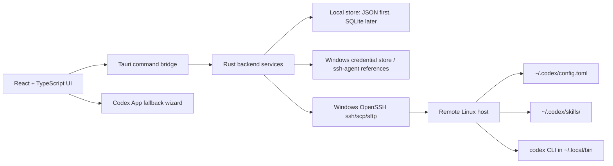

# CodexHub Architecture

Date: 2026-07-01
Target: Cross-platform desktop MVP using Tauri 2, React, TypeScript, Vite, and Rust, with Windows and macOS release-build support.

## Architecture Principle

CodexHub is a desktop control plane for Codex App SSH-based remote development. MVP does not require a remote Codex wrapper. CodexHub connects to the user's remote Linux hosts over SSH/SFTP and directly manages remote Codex files:

- `~/.codex/config.toml`
- `~/.codex/skills/`

Codex App remains the interactive coding surface. If Codex App has no public API for host registration or reconnect, CodexHub provides a safe fallback wizard instead of touching private app state.

The local platform layer owns OS-specific paths and command discovery. Windows keeps `%USERPROFILE%\.ssh\config`, while macOS uses `~/.ssh/config`, `~/.ssh/id_ed25519`, `~/.codex/config.toml`, `~/.codex/skills`, and the Codex binary search order documented in `docs/macos-support.md`.

## Runtime Layers



## Frontend Modules

- Servers: host inventory, aliases, labels, SSH config status, connection health.
- Profiles: local profile templates, CRUD/import/export, env-var-first API key policy, rendered remote TOML preview, and single or selected-host batch apply.
- Skills: local skill packages, GitHub search/clone import, remote upload/install status, remote list, and backup delete.
- Operations: backup, apply, restore, dry-run, and audit log.
- Codex App Fallback: manual steps for enabling SSH hosts and reconnecting in Codex App.
- Settings: local data location, remote paths, OpenSSH binary overrides, theme, and privacy controls.

## Rust Backend Services

Tauri command surface:

- `app_health()`: smoke-test command exposed by the desktop backend.
- `get_settings()` / `save_settings(settings)`: persist local appearance and setup-guide state.
- `get_local_codex_status()`: inspect the local Codex CLI path and version without installing anything.
- `get_ssh_status()`: inspect local OpenSSH state and public-key availability without reading private key contents.
- `generate_ed25519_key()`: generate a non-overwriting local Ed25519 keypair.
- `list_ssh_config_hosts()`: parse safe managed and unmanaged `%USERPROFILE%\.ssh\config` aliases without modifying user-owned blocks.
- `upsert_ssh_config_host(draft)` / `delete_ssh_config_host(alias)`: write or remove only scoped CodexHub-managed/local target blocks with backups and task evidence.
- `list_hosts()`, `refresh_discovered_hosts()`, `add_host()`, `update_host()`, `delete_host()`: manage CodexHub's durable host inventory while keeping discovery read-only.
- `test_ssh_connection(host_id)` / `ssh_check(host_alias)`: run `ssh <HostAlias> echo ok` through system OpenSSH with timeout and redacted logs.
- `bootstrap_ssh_host(draft, password, request_id)`: use a one-time password through the Rust SSH client to install the local public key, set permissions, write a managed SSH config block, and verify key login.
- `bootstrap_existing_ssh_host(host_alias, password)`: run the same key setup for a discovered host without changing unmanaged blocks.
- `remote_probe_codex(host_alias)`: check OS, arch, shell, PATH, `codex --version`, `~/.codex/config.toml`, and skills on the backend worker pool.
- `remote_manage_codex(host_alias, action, timeout_ms)`: run single-host `check-version`, `install`, or `update` for the real remote `codex` command.
- `refresh_latest_codex_version()`: refresh/cache the latest known Codex CLI version.
- `list_profiles()`, `create_profile()`, `update_profile()`, `delete_profile()`, `duplicate_profile()`, `import_profiles()`: manage local structured profile templates without exporting secret values.
- `set_profile_api_key(profile_id, api_key)`, `get_profile_api_key(profile_id)`, `delete_profile_api_key(profile_id)`: optionally store or retrieve a local credential-store value while profile JSON keeps only credential state.
- `detect_cc_switch_profiles()` / `import_cc_switch_profiles()`: import compatible local profile definitions without persisting credential values in profile JSON.
- `preview_profile_apply(profile_id, host_ids)`: render TOML and summarize per-host remote config actions before mutation.
- `apply_profile(profile_id, host_ids)`: backup, upload temp file, atomically replace remote config, write apply metadata, refresh host/profile state, and record redacted task logs.
- `list_local_skills()` / `list_skill_packs()`: read persisted local managed skills.
- `import_local_skill(path)`: validate `SKILL.md` at the selected directory or immediate child directories, then copy valid skills into CodexHub-managed storage.
- `update_library_skill_about(skill_id, about)`: persist a user-edited library About/details field for preview.
- `get_skill_inventory_status()`: read whether the first host skill inventory scan has completed and return remembered local/host skill lists.
- `detect_installed_skills(include_hosts, timeout_ms)`: scan local Codex skill roots and, when requested, configured host skill roots.
- `download_github_skill(repo_url, timeout_ms)`: accept direct GitHub repository URLs and `tree/<branch>/<skill-path>` subdirectory URLs, shallow clone, validate, and import valid skills.
- `get_skill_targets(skill_id, timeout_ms)`: use cached inventory to return installable/uninstallable targets for the library table.
- `install_skill_targets(skill_id, targets, timeout_ms)` / `uninstall_skill_targets(skill_id, targets, timeout_ms)`: install or backup-remove the managed copy on selected local or host targets.
- `delete_library_skill(skill_id, uninstall_first, timeout_ms)`: remove the CodexHub library record and managed copy, optionally uninstalling known targets first.
- `list_tasks()`: return the in-memory redacted task log for the current app session.

## Local Data Model

Initial persistence can be JSON/TOML to keep the skeleton simple. SQLite becomes useful once the UI has searchable operation history.

```ts
type Server = {
  id: string;
  name: string;
  hostAlias: string;
  hostName?: string;
  user?: string;
  port?: number;
  sshConfigManagedBlockId?: string;
  codexConfigPath: string;      // default ~/.codex/config.toml
  codexSkillRoot: string;       // default ~/.codex/skills
  createdAt: string;
  updatedAt: string;
};

type ProfileTemplate = {
  id: string;
  name: string;
  description?: string;
  config: Record<string, unknown>;
  profileTables: Record<string, Record<string, unknown>>;
  apiKeyEnvVar?: string;
  credentialStored: boolean;
};

type SkillPackage = {
  id: string;
  name: string;
  description: string;
  about: string;
  version: string;
  sourceType: "local" | "github" | string;
  source: string;
  originalPath?: string;
  managedPath: string;
  hasSkillMd: boolean;
  addedAt: string;
  updatedAt: string;
  applications: SkillApplication[];
};

type SkillApplication = {
  targetType: "local" | "host" | string;
  label: string;
  hostAlias?: string | null;
  path: string;
  detectedAt: string;
  hasSkillMd: boolean;
};

type SkillInventoryStatus = {
  firstHostScanCompleted: boolean;
  localSkillRoot: string;
  localSkills: RemoteSkill[];
  hostInventories: HostSkillInventory[];
};

type OperationLog = {
  id: string;
  serverId: string;
  kind: "ssh-check" | "probe-codex" | "manage-codex" | "apply-config" | "sync-skill" | "restore" | "skill-list" | "skill-install" | "skill-delete";
  status: "planned" | "running" | "succeeded" | "failed";
  startedAt: string;
  finishedAt?: string;
  backupPath?: string;
  message?: string;
};
```

## Release Channel Data Isolation

CodexHub v0.2.5 continues to define exactly two release channels: `stable` and `dev`.

- `stable` is the public release channel. It uses `src-tauri/tauri.conf.json`, `productName: CodexHub`, `identifier: app.codexhub.desktop`, and window title `CodexHub`.
- `dev` is for development, test runs, previews, and manual acceptance. It uses `src-tauri/tauri.dev.conf.json`, `productName: CodexHub Dev`, `identifier: dev.codexhub.desktop`, and window title `CodexHub Dev`.

The backend must keep local runtime state on Tauri's app-scoped path resolver rather than hand-built app data paths. Config files such as `settings.json`, `hosts.json`, `profiles.json`, `skills.json`, `skills-inventory.json`, and `codex-latest.json` use `app.path().app_config_dir()`. Temporary profile-apply files and cloned GitHub skill cache use `app.path().app_cache_dir()`. Tauri resolves both paths under the OS config/cache root plus the bundle identifier, so the different identifiers give `stable` and `dev` separate local app config/cache directories while still allowing both apps to be installed and run side by side.

This isolation does not automatically isolate shared local or remote surfaces. `%USERPROFILE%\.ssh\config`, local SSH keys, remote `~/.codex/config.toml`, remote `~/.codex/skills/`, and remote shell files remain shared unless the user deliberately points a workflow at separate hosts, aliases, or paths. Any write to those surfaces must keep the same scoped-write, backup, idempotency, and redaction rules.

See [release channel details](release-channels.md).

## Desktop Lifecycle

CodexHub creates a Tauri tray/status icon at startup using the app icon and display name (`CodexHub` or `CodexHub Dev`). Left-clicking the icon restores and focuses the main window. The icon menu exposes Show and Quit actions; Quit always calls the app exit path.

The main window close button is controlled by persisted `settings.json` field `closeButtonBehavior` with values `ask`, `exit`, or `minimize-to-tray`. Legacy settings without the field default to `ask`. In `ask` mode, the Rust close handler prevents the native close and emits `close-button-behavior-requested`; the React modal lets the user choose Exit app or Minimize to tray, persists the choice through `choose_close_button_behavior`, and immediately performs the selected action. Explicit Quit entries, including tray Quit and the macOS app menu / `Cmd+Q`, remain true exit paths and are not governed by the close-button preference.

macOS keeps the Dock icon in v1. Menu bar/status item behavior, close-to-hidden behavior, restore behavior, and `Cmd+Q` must be marked `Requires real macOS test` until verified on a real Mac.

## Stable Updater Foundation

CodexHub wires Tauri 2 updater checks only for `stable`. The backend initializes `tauri-plugin-updater` and exposes `get_app_update_status()`, `check_stable_update()`, and gated `install_stable_update()` commands so Settings can display a compact Version info table and a manual install action only after a signed update is discovered.

Each `check_stable_update()` attempt records a local `Check app update` task run. Frontend update-check failures open the task log modal immediately, avoid rendering the full error inline below the Version card, and point users to the Tasks detail page for later review.

The stable updater is pending until the release build injects `CODEXHUB_STABLE_UPDATE_ENDPOINT` and `CODEXHUB_STABLE_UPDATER_PUBKEY`. The build/runtime path normalizes the updater public key to the direct Tauri public key string before checking signatures. The stable Check button can still be clicked so Settings reports `pending-configuration` honestly when those values are absent. Windows signed updater assets are produced by the dedicated release workflow with Tauri updater artifacts enabled, then published through `latest.json`; the public Release keeps the setup installer, `latest.json`, and `SHA256SUMS.txt` rather than a standalone `.sig` asset. macOS Apple Silicon uses an unsigned/ad-hoc `.dmg` for installation and an updater `.app.tar.gz` archive, with unsigned status documented only outside the app UI. `dev` stays non-updating and is handled by local builds, preview packages, or test artifacts. Installer/download actions remain disabled unless the real feed, signatures, and publisher workflow are approved and the latest check returns `available`.

See [stable updater details](stable-updater.md).

## Remote Codex CLI Maintenance

Single-host install/update is implemented through plain SSH. CodexHub keeps the user-facing remote command as `codex`; profile apply may install a same-name CodexHub-managed launcher under `~/.local/bin/codex` only to source managed environment variables before execing the real Codex binary.

1. Verify SSH with `ssh <HostAlias> echo ok`.
2. Record the current Codex path and `codex --version` using the resolver that also checks `~/.local/bin/codex`.
3. Ensure `~/.local/bin` exists.
4. Check whether the current remote shell can resolve `command -v codex`; this is stored separately from "installed" because the resolver can find `~/.local/bin/codex` even when the user's shell PATH cannot.
5. Check `.bashrc` or `.zshrc`, `.profile`, and existing `.bash_profile` / `.zprofile`, create timestamped backups before writing, and add or replace a CodexHub-managed PATH block idempotently only when no existing `$HOME/.local/bin` entry is present.
6. Run the official standalone installer from `https://chatgpt.com/codex/install.sh` with user-directory environment variables.
7. If the official installer fails or cannot be reached, download the platform-native `@openai/codex` package from `https://registry.npmmirror.com` into `~/.codex/packages/standalone/releases/<version>` and symlink `~/.local/bin/codex`.
8. If remote downloads are blocked or redirected but SSH/SCP still works, download the same npmmirror native package on the local Windows machine, upload it with `scp`, and install it into the same user-owned remote paths.
9. If the native package fallback is not available, run `npm install -g @openai/codex --prefix "$HOME/.local" --registry=https://registry.npmmirror.com`.
10. Re-run the resolver, `command -v codex`, and `codex --version`, then store the complete task log.

For long install/update runs, the Rust backend executes the blocking SSH/curl/scp work off the window-responsive command path and emits `remote-codex-progress` events keyed by a frontend `requestId`. The compact progress modal consumes these events to show step changes, streamed stdout/stderr lines, and heartbeat messages before the final `TaskRun` is returned.

The remote script must not use `sudo`, `/usr/local/bin`, `chown`, or a root-owned install path. Repeat runs should not duplicate the PATH block and should not create a backup when no shell config write is needed.

The primary UI entry is a compact all-host readiness list on the Profiles / 配置 page. Dashboard may expose the same single-host actions as shortcuts, while Host pages stay focused on SSH details, probes, and diagnostics.

## Remote Write Algorithm

Every remote file mutation must be previewable, backed up, and idempotent.

1. Resolve target paths with conservative shell quoting.
2. Run `mkdir -p ~/.codex ~/.codex/skills` only after explicit apply.
3. If `~/.codex/config.toml` exists, download it for diff and create `~/.codex/config.toml.codexhub.bak.<timestamp>`.
4. Upload rendered TOML to `~/.codex/config.toml.codexhub.tmp.<operation-id>`.
5. Validate that the uploaded temp file is non-empty and has the expected checksum.
6. Move temp file to `~/.codex/config.toml` on the remote host.
7. Store operation metadata and backup path locally.
8. If the rendered config is identical to the current remote config, report "no changes" and do not create a new backup.

## Profile And API Config Management

Window 5 profile switching is file-based and implemented through the direct SSH/SFTP path:

- CodexHub stores structured profile templates locally and supports CRUD plus import/export.
- API key handling is env-var-first. Rendered TOML uses `env_key` / `apiKeyEnvVar` so the remote host resolves its own environment variable.
- An optional API key value can be stored in the local OS credential store for local convenience, but only a `credentialStored` boolean is kept in profile JSON.
- When a profile with a stored key is explicitly applied to selected hosts, CodexHub writes the real key only to `~/.codex-hub/env` with mode `600`, creates a timestamped backup before replacing an existing env file, and adds managed source blocks to `.bashrc` or `.zshrc`, `.profile`, and existing `.bash_profile` / `.zprofile`.
- The same apply step records the real Codex target in `~/.codex-hub/codex-target` and installs a command-preserving `~/.local/bin/codex` launcher that sources `~/.codex-hub/env` before execing the real binary.
- Applying a profile renders the entire desired `~/.codex/config.toml`.
- CodexHub replaces the remote config after diff/backup, writes local/remote apply metadata, and checks whether the referenced remote API env var exists without printing its value.
- Apply can target one host or a selected-host batch, with each host producing a separate redacted task log.
- The user starts a new Codex session or follows the reconnect fallback in Codex App.

This avoids a separate user-facing wrapper command and avoids assumptions about Codex App internals. A future profile-selection wrapper can be added as an opt-in enhancement for hosts where runtime `codex --profile <name>` orchestration is desired.

## Skill Management

Window 6 skill management is folder-based and uses the same direct SSH/SCP route as profile apply:

- Local import accepts a selected directory with `SKILL.md`, or scans immediate child directories and imports each valid child.
- Imported skills are copied into CodexHub-managed app config storage so later remote installs do not depend on the original source path.
- Online discovery accepts direct `https://github.com/<owner>/<repo>` / `.git` repository URLs and `https://github.com/<owner>/<repo>/tree/<branch>/<skill-path>` skill subdirectory URLs. Download uses `git clone --depth 1` and reuses the same `SKILL.md` scan on the selected root or subdirectory; preview details default to the `SKILL.md` frontmatter `description`.
- Installed-skill detection scans the local Codex skill root plus every configured host and persists the local and host skill inventory. Remote detection covers both `~/.codex/skills` and `~/.codex/superpowers/skills`, including hidden second-level layouts such as `.system/<skill>/SKILL.md`. Manual detection refreshes the host cache, the Refresh button reloads the page from the local cache only, and install/uninstall modals read the cache without probing every host on open.
- The Skills page presents one local library table with `Skill`, `Source`, `Added`, `Applied`, and `Actions` columns.
- The Skills page also presents an installed skill library table with local machine and host rows, showing alias, source, host IP, and compact skill tags colored consistently by skill name.
- The Applied column is derived from `SkillApplication` rows: local installs show the local machine label, host installs show the host alias, and empty applications show an unapplied badge.
- Target checks read the persisted inventory cache rather than probing every host on modal open. Already-installed, unavailable, or never-scanned targets are not selectable for install until detection refreshes the cache.
- Install packages the managed skill as `.tgz`, uploads to `/tmp`, extracts to staging, validates `SKILL.md`, and installs only to the default Codex skills root.
- Uninstall moves local installs into a CodexHub backup folder under the local skills root and moves remote skill directories to timestamped backups.
- Delete can uninstall known applications first, or directly remove only the CodexHub local library record and managed copy.
- The MVP does not manage `.agents/skills`; keep path-drift handling as a later setting or host capability check.

## SSH Config Policy

Default behavior is read-only analysis of the platform SSH config path: `%USERPROFILE%\.ssh\config` on Windows and `~/.ssh/config` on macOS.

Optional write behavior must follow these rules:

- Generate a diff before writing.
- Create a timestamped backup beside the original config.
- Only manage marked CodexHub blocks.
- Preserve comments and unrelated `Host` blocks.
- Never overwrite private keys or shell config.

## Credential Policy

- Do not store SSH private keys or passphrases in CodexHub data files.
- Prefer Windows OpenSSH agent, Windows credential store, or references to existing key paths.
- If an API key must be remembered locally, store only through the OS credential store and keep profile JSON to non-secret credential state.
- Remote config must use `env_key` / `apiKeyEnvVar`; CodexHub must never write the stored local credential or an API key value to remote config, apply metadata, app JSON, or task logs.
- Profile apply may upload the stored key only to the selected host's CodexHub-managed `~/.codex-hub/env` file with mode `600` and redacted logs.
- Probes and profile apply tasks may report an env var as missing, but they must not print the env var value.
- Operation logs must redact usernames only when requested, but always redact key material, passphrases, tokens, and private host secrets.

## Codex App Fallback UX

Because no public stable API was found for automatic host registration or forced reconnect, the MVP fallback is explicit:

1. Show the SSH alias CodexHub verified.
2. Show the exact Codex App navigation: Settings > Codex > Connections.
3. Provide copy buttons for the alias and test commands.
4. Show what CodexHub already changed on the remote host.
5. Provide rollback/restore actions for files CodexHub changed.
6. Avoid private Codex App files, databases, sockets, and undocumented IPC.

## Future Optional Wrapper

A remote wrapper is a later enhancement, not an MVP dependency. It may provide:

- Runtime profile selection without replacing the default config.
- Remote health endpoints.
- More precise Codex CLI checks.
- Remote-side atomic operations with richer validation.

Wrapper adoption must remain opt-in and must not block the direct SSH/SFTP path.
