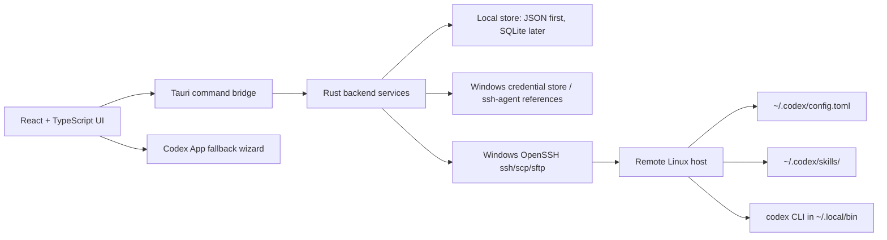

# CodexHub Architecture

Date: 2026-06-26
Target: Windows desktop MVP using Tauri 2, React, TypeScript, Vite, and Rust.

## Architecture Principle

CodexHub is a desktop control plane for Codex App SSH-based remote development. MVP does not require a remote Codex wrapper. CodexHub connects to the user's remote Linux hosts over SSH/SFTP and directly manages remote Codex files:

- `~/.codex/config.toml`
- `~/.codex/skills/`

Codex App remains the interactive coding surface. If Codex App has no public API for host registration or reconnect, CodexHub provides a safe fallback wizard instead of touching private app state.

## Runtime Layers



## Frontend Modules

- Servers: host inventory, aliases, labels, SSH config status, connection health.
- Profiles: local profile templates, CRUD/import/export, env-var-first API key policy, rendered remote TOML preview, and single or selected-host batch apply.
- Skills: local skill packages, GitHub search/clone import, remote upload/install status, remote list, and backup delete.
- Operations: backup, apply, restore, dry-run, and audit log.
- Codex App Fallback: manual steps for enabling SSH hosts and reconnecting in Codex App.
- Settings: local data location, remote paths, OpenSSH binary overrides, theme, and privacy controls.

## Rust Backend Services

Tauri command surface:

- `app_health()`: smoke-test command exposed by the skeleton.
- `list_ssh_hosts()`: parse safe managed and unmanaged `%USERPROFILE%\.ssh\config` aliases without modifying user-owned blocks.
- `generate_ssh_host_block(input)`: produce an idempotent suggested host block.
- `append_ssh_host_block_with_backup(input)`: optional explicit write path with timestamped backup.
- `refresh_discovered_hosts()`: merge read-only local SSH aliases into the in-memory host inventory.
- `ssh_check(host_alias)`: run `ssh <HostAlias> echo ok` through system OpenSSH with timeout and redacted logs on the backend blocking worker pool.
- `bootstrap_ssh_host(draft, password, request_id)`: use a one-time password through the Rust SSH client to log in, install the local public key, set `~/.ssh` permissions, emit four-step progress events, write only a CodexHub-managed SSH config block, then verify `ssh <HostAlias> echo ok` with system OpenSSH.
- `bootstrap_existing_ssh_host(host_alias, password)`: run the same key setup for a host already discovered in SSH config without changing unmanaged blocks.
- `remote_probe_codex(host_alias)`: check OS, arch, shell, PATH, `codex --version`, `~/.codex/config.toml`, and `~/.codex/skills` on the backend blocking worker pool.
- `remote_manage_codex(host_alias, action, timeout_ms)`: run single-host `check-version`, `install`, or `update` for the real remote `codex` command on the backend blocking worker pool, returning before/after version, Codex path, install method, PATH repair metadata, backup path, and full task log.
- `create_profile(profile)`, `update_profile(profile)`, `delete_profile(profile_id)`, `duplicate_profile(profile_id)`: manage local structured profile templates.
- `import_profiles(payload)`, `export_profiles(profile_ids)`: move profile definitions in and out without secret values.
- `set_profile_api_key(profile_id, api_key)` and `delete_profile_api_key(profile_id)`: optionally store a local API key value in the OS credential store. Profile JSON keeps only `credentialStored` state, and the stored credential never leaves the local machine.
- `detect_cc_switch_profiles()` and `import_cc_switch_profiles()`: import compatible local profile definitions without importing credential values.
- `render_profile_config(profile_id)`: render TOML from structured profile state.
- `preview_profile_apply(profile_id, host_ids)`: render TOML and summarize per-host remote config actions before mutation.
- `apply_profile(profile_id, host_ids)`: backup, upload temp file, atomically replace remote config, write apply metadata, and record redacted task logs for a single host or selected-host batch.
- `list_local_skills()` / `list_skill_packs()`: read persisted local managed skills.
- `import_local_skill(path)`: validate `SKILL.md` at the selected directory or immediate child directories, then copy valid skills into CodexHub-managed storage.
- `update_library_skill_about(skill_id, about)`: persist a user-edited library About/details field for preview.
- `get_skill_inventory_status()`: read whether the first host skill inventory scan has completed and return the remembered host skill lists.
- `detect_installed_skills(include_hosts, timeout_ms)`: scan `%CODEX_HOME%\skills` or `%USERPROFILE%\.codex\skills`; on first scan it can also list every configured host's `~/.codex/skills`.
- `download_github_skill(repo_url, timeout_ms)`: accept direct `https://github.com/<owner>/<repo>` / `.git` repository URLs and `tree/<branch>/<skill-path>` subdirectory URLs, shallow clone, and import valid skills; preview details default to the `SKILL.md` frontmatter `description`.
- `get_skill_targets(skill_id, timeout_ms)`: check the local Codex skills root and configured hosts, returning installable/uninstallable targets for the library table.
- `install_skill_targets(skill_id, targets, timeout_ms)`: install the managed copy to the selected local or host Codex skills root.
- `uninstall_skill_targets(skill_id, targets, timeout_ms)`: move local installs into a local CodexHub backup folder and use the remote backup-delete flow for host installs.
- `delete_library_skill(skill_id, uninstall_first, timeout_ms)`: remove the CodexHub library record and managed copy, optionally uninstalling known targets first.
- `remote_restore_backup(server_id, backup_id)`: restore a known CodexHub backup.

## Local Data Model

Initial persistence can be JSON/TOML to keep the skeleton simple. SQLite becomes useful once the UI has searchable operation history.

```ts
type Server = {
  id: string;
  name: string;
  hostAlias: string;
  hostName?: string;
  user?: string;
  port?: number;
  sshConfigManagedBlockId?: string;
  codexConfigPath: string;      // default ~/.codex/config.toml
  codexSkillRoot: string;       // default ~/.codex/skills
  createdAt: string;
  updatedAt: string;
};

type ProfileTemplate = {
  id: string;
  name: string;
  description?: string;
  config: Record<string, unknown>;
  profileTables: Record<string, Record<string, unknown>>;
  apiKeyEnvVar?: string;
  credentialStored: boolean;
};

type SkillPackage = {
  id: string;
  name: string;
  description: string;
  about: string;
  version: string;
  sourceType: "local" | "github" | string;
  source: string;
  originalPath?: string;
  managedPath: string;
  hasSkillMd: boolean;
  addedAt: string;
  updatedAt: string;
  applications: SkillApplication[];
};

type SkillApplication = {
  targetType: "local" | "host" | string;
  label: string;
  hostAlias?: string | null;
  path: string;
  detectedAt: string;
  hasSkillMd: boolean;
};

type SkillInventoryStatus = {
  firstHostScanCompleted: boolean;
  localSkillRoot: string;
  localSkills: RemoteSkill[];
  hostInventories: HostSkillInventory[];
};

type OperationLog = {
  id: string;
  serverId: string;
  kind: "ssh-check" | "probe-codex" | "manage-codex" | "apply-config" | "sync-skill" | "restore" | "skill-list" | "skill-install" | "skill-delete";
  status: "planned" | "running" | "succeeded" | "failed";
  startedAt: string;
  finishedAt?: string;
  backupPath?: string;
  message?: string;
};
```

## Remote Codex CLI Maintenance

Single-host install/update is implemented through plain SSH and does not install a wrapper. CodexHub keeps the remote executable as `codex` and prepares the user environment only:

1. Verify SSH with `ssh <HostAlias> echo ok`.
2. Record the current Codex path and `codex --version` using the resolver that also checks `~/.local/bin/codex`.
3. Ensure `~/.local/bin` exists.
4. If `~/.local/bin` is not already in PATH, choose `~/.bashrc` or `~/.zshrc`, create a timestamped backup before writing, and add or replace a CodexHub-managed PATH block idempotently.
5. Run the official standalone installer from `https://chatgpt.com/codex/install.sh` with user-directory environment variables.
6. If the official installer fails or cannot be reached, download the platform-native `@openai/codex` package from `https://registry.npmmirror.com` into `~/.codex/packages/standalone/releases/<version>` and symlink `~/.local/bin/codex`.
7. If remote downloads are blocked or redirected but SSH/SCP still works, download the same npmmirror native package on the local Windows machine, upload it with `scp`, and install it into the same user-owned remote paths.
8. If the native package fallback is not available, run `npm install -g @openai/codex --prefix "$HOME/.local" --registry=https://registry.npmmirror.com`.
9. Re-run the resolver and `codex --version`, then store the complete task log.

For long install/update runs, the Rust backend executes the blocking SSH/curl/scp work off the window-responsive command path and emits `remote-codex-progress` events keyed by a frontend `requestId`. The compact progress modal consumes these events to show step changes, streamed stdout/stderr lines, and heartbeat messages before the final `TaskRun` is returned.

The remote script must not use `sudo`, `/usr/local/bin`, `chown`, or a root-owned install path. Repeat runs should not duplicate the PATH block and should not create a backup when no shell config write is needed.

The primary UI entry is a compact all-host readiness list on the Profiles / 配置 page. Dashboard may expose the same single-host actions as shortcuts, while Host pages stay focused on SSH details, probes, and diagnostics.

## Remote Write Algorithm

Every remote file mutation must be previewable, backed up, and idempotent.

1. Resolve target paths with conservative shell quoting.
2. Run `mkdir -p ~/.codex ~/.codex/skills` only after explicit apply.
3. If `~/.codex/config.toml` exists, download it for diff and create `~/.codex/config.toml.codexhub.bak.<timestamp>`.
4. Upload rendered TOML to `~/.codex/config.toml.codexhub.tmp.<operation-id>`.
5. Validate that the uploaded temp file is non-empty and has the expected checksum.
6. Move temp file to `~/.codex/config.toml` on the remote host.
7. Store operation metadata and backup path locally.
8. If the rendered config is identical to the current remote config, report "no changes" and do not create a new backup.

## Profile And API Config Management

Window 5 profile switching is file-based and implemented through the direct SSH/SFTP path:

- CodexHub stores structured profile templates locally and supports CRUD plus import/export.
- API key handling is env-var-first. Rendered TOML uses `env_key` / `apiKeyEnvVar` so the remote host resolves its own environment variable.
- An optional API key value can be stored in the local OS credential store for local convenience, but only a `credentialStored` boolean is kept in profile JSON and the stored credential is never written into remote config, apply metadata, or task logs.
- Applying a profile renders the entire desired `~/.codex/config.toml`.
- CodexHub replaces the remote config after diff/backup and writes local/remote apply metadata.
- Apply can target one host or a selected-host batch, with each host producing a separate redacted task log.
- The user starts a new Codex session or follows the reconnect fallback in Codex App.

This avoids a remote wrapper and avoids assumptions about Codex App internals. A future wrapper can be added as an opt-in enhancement for hosts where runtime `codex --profile <name>` orchestration is desired.

## Skill Management

Window 6 skill management is folder-based and uses the same direct SSH/SCP route as profile apply:

- Local import accepts a selected directory with `SKILL.md`, or scans immediate child directories and imports each valid child.
- Imported skills are copied into CodexHub-managed app config storage so later remote installs do not depend on the original source path.
- Online discovery accepts direct `https://github.com/<owner>/<repo>` / `.git` repository URLs and `https://github.com/<owner>/<repo>/tree/<branch>/<skill-path>` skill subdirectory URLs. Download uses `git clone --depth 1` and reuses the same `SKILL.md` scan on the selected root or subdirectory; preview details default to the `SKILL.md` frontmatter `description`.
- Installed-skill detection scans the local Codex skill root plus every configured host and persists the local and host skill inventory. Remote detection covers both `~/.codex/skills` and `~/.codex/superpowers/skills`, including hidden second-level layouts such as `.system/<skill>/SKILL.md`. Manual detection refreshes the host cache, the Refresh button reloads the page from the local cache only, and install/uninstall modals read the cache without probing every host on open.
- The Skills page presents one local library table with `Skill`, `Source`, `Added`, `Applied`, and `Actions` columns.
- The Skills page also presents an installed skill library table with local machine and host rows, showing alias, source, host IP, and compact skill tags colored consistently by skill name.
- The Applied column is derived from `SkillApplication` rows: local installs show the local machine label, host installs show the host alias, and empty applications show an unapplied badge.
- Target checks read the persisted inventory cache rather than probing every host on modal open. Already-installed, unavailable, or never-scanned targets are not selectable for install until detection refreshes the cache.
- Install packages the managed skill as `.tgz`, uploads to `/tmp`, extracts to staging, validates `SKILL.md`, and installs only to the default Codex skills root.
- Uninstall moves local installs into a CodexHub backup folder under the local skills root and moves remote skill directories to timestamped backups.
- Delete can uninstall known applications first, or directly remove only the CodexHub local library record and managed copy.
- The MVP does not manage `.agents/skills`; keep path-drift handling as a later setting or host capability check.

## SSH Config Policy

Default behavior is read-only analysis of `%USERPROFILE%\.ssh\config`.

Optional write behavior must follow these rules:

- Generate a diff before writing.
- Create a timestamped backup beside the original config.
- Only manage marked CodexHub blocks.
- Preserve comments and unrelated `Host` blocks.
- Never overwrite private keys or shell config.

## Credential Policy

- Do not store SSH private keys or passphrases in CodexHub data files.
- Prefer Windows OpenSSH agent, Windows credential store, or references to existing key paths.
- If an API key must be remembered locally, store only through the OS credential store and keep profile JSON to non-secret credential state.
- Remote config must use `env_key` / `apiKeyEnvVar`; CodexHub must never write the stored local credential or an API key value to remote hosts.
- Operation logs must redact usernames only when requested, but always redact key material, passphrases, tokens, and private host secrets.

## Codex App Fallback UX

Because no public stable API was found for automatic host registration or forced reconnect, the MVP fallback is explicit:

1. Show the SSH alias CodexHub verified.
2. Show the exact Codex App navigation: Settings > Codex > Connections.
3. Provide copy buttons for the alias and test commands.
4. Show what CodexHub already changed on the remote host.
5. Provide rollback/restore actions for files CodexHub changed.
6. Avoid private Codex App files, databases, sockets, and undocumented IPC.

## Future Optional Wrapper

A remote wrapper is a later enhancement, not an MVP dependency. It may provide:

- Runtime profile selection without replacing the default config.
- Remote health endpoints.
- More precise Codex CLI checks.
- Remote-side atomic operations with richer validation.

Wrapper adoption must remain opt-in and must not block the direct SSH/SFTP path.
