

  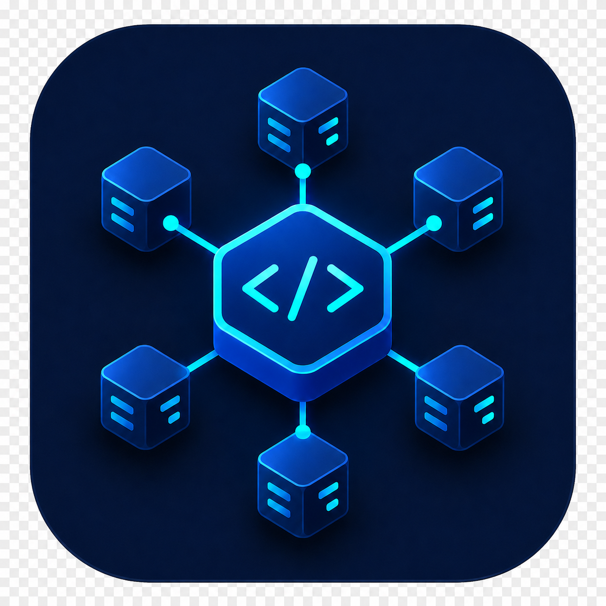

  <h1>CodexHub</h1>

  
<strong>面向 Codex App SSH 工作流的通用桌面控制台，支持 Windows、macOS 和 Linux。</strong>

  
准备 Linux 主机、安装或更新远端 Codex、应用 profile、同步 skills，并查看脱敏任务日志；不写入 Codex App 私有状态。

  

    <a href="../../README.md">English README</a>
    ·
    <a href="#-安装">安装</a>
    ·
    <a href="../known-limitations.md">已知限制</a>
    ·
    <a href="../../SECURITY.md">安全策略</a>
  

  

    
    
    
    
    
    
  

## 🧭 快速了解

CodexHub 聚焦一个清晰场景：让 Windows、macOS 或 Linux 桌面上的 Codex App 更安全、可审计地使用多台 SSH Linux 主机。

- 管理本地 OpenSSH key 状态和 CodexHub 托管的 SSH alias。
- 用一次性密码初始化新 Linux 主机，再切换到 key 登录。
- 在修改前探测远端 Codex、config、shell、PATH 和 skill 状态。
- 预览并应用 Codex profile 和 skills，通过显式确认与脱敏日志追踪结果。
- 验证 SSH alias 后，引导用户去 Codex App `Settings > Codex > Connections` 添加连接。

## 🖼️ 截图

| 视图 | Windows | macOS |
| --- | --- | --- |
| **Dashboard** 一屏查看所有托管主机的 SSH 连通性、远端 Codex 状态、profile 对齐情况、skill inventory 和近期任务结果。 | 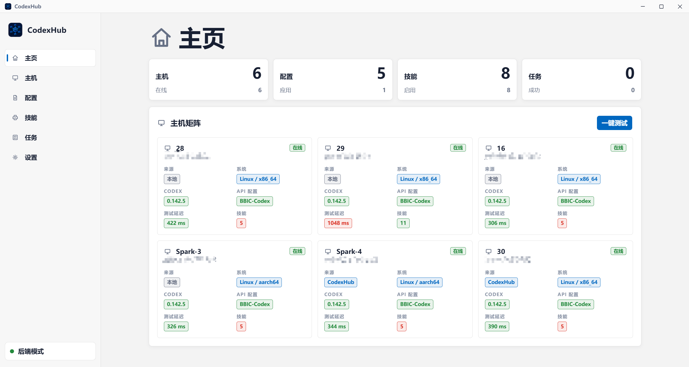 | 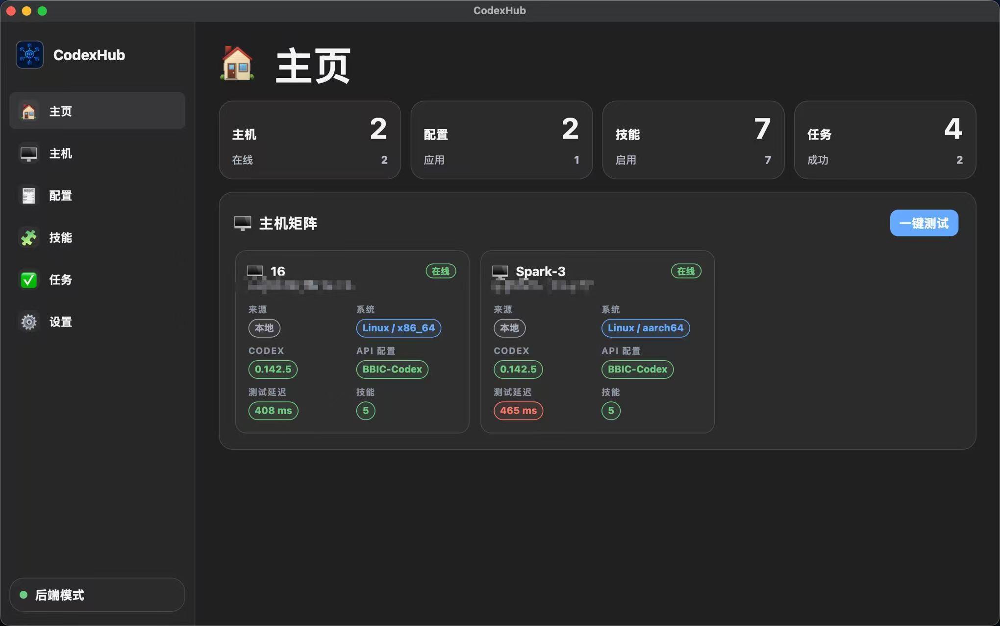 |
| **监控** 查看已记住主机的只读 CPU、内存和 GPU 采样结果，并显示刷新状态和慢主机超时耗时提示。 | 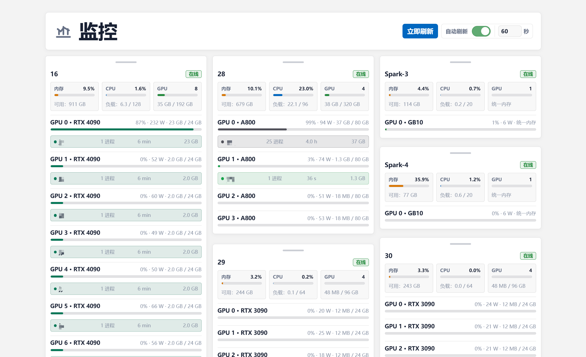 | 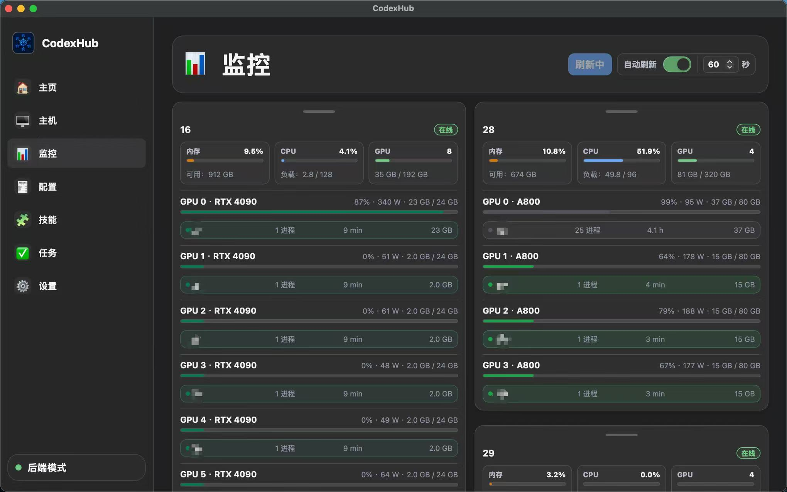 |
| **Hosts** 添加或检查 SSH 主机，完成 key 配置、一次性密码初始化、连接测试和远端 Codex 探测。 | 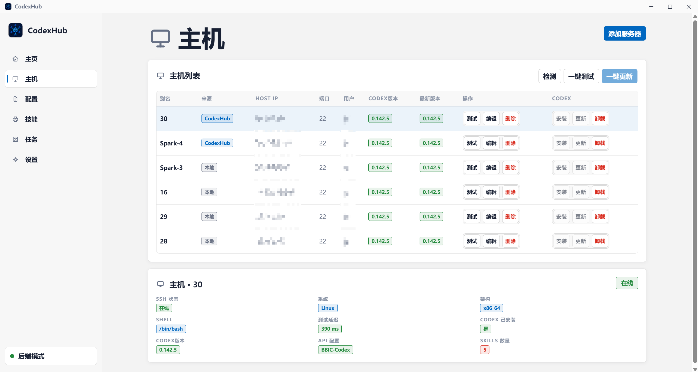 | 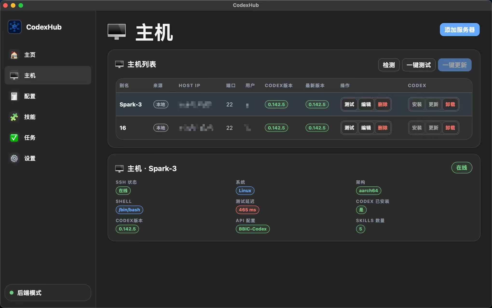 |
| **API 与 Profiles** 管理本地 API config 名称和 profile 模板，再预览或应用远端配置变更。 | 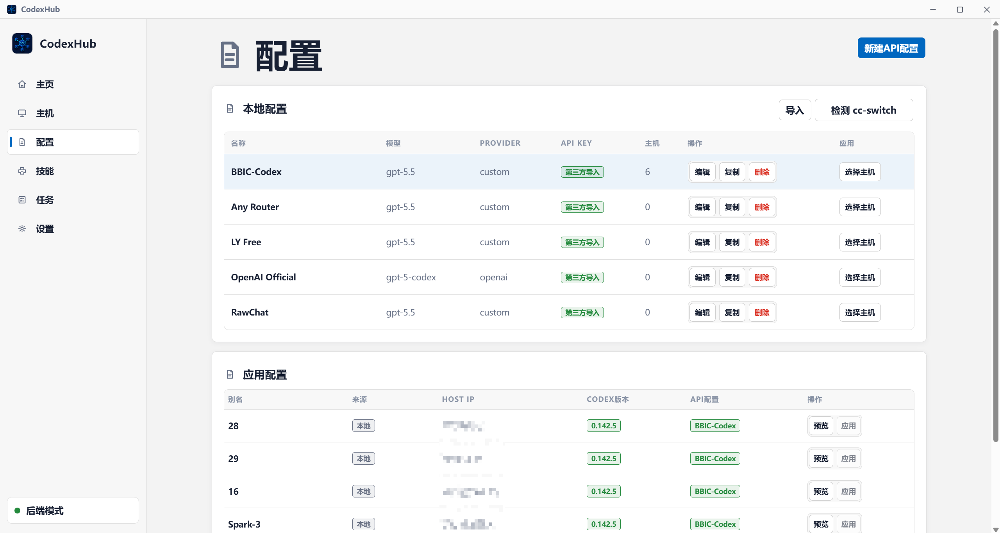 | 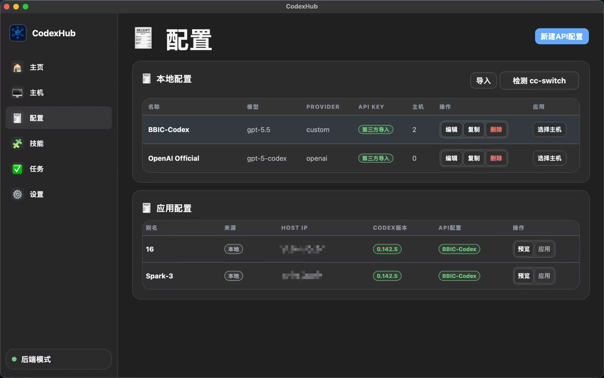 |
| **Skills** 导入本地或 GitHub skill 包，检查安装目标 inventory，预览已安装 skill 标签，并通过任务日志追踪下载或移除结果。 | 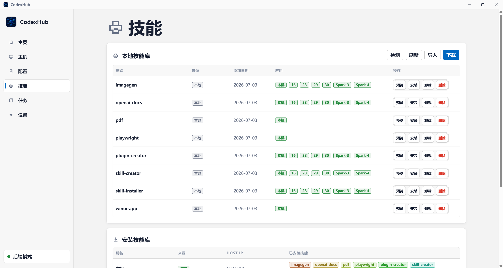 | 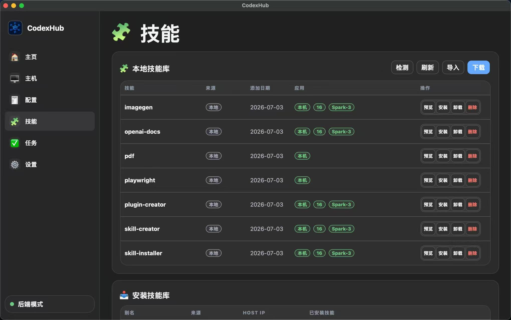 |
| **Settings** 检查本地 SSH 就绪状态、管理应用更新检查，并查看平台相关运行偏好。 | 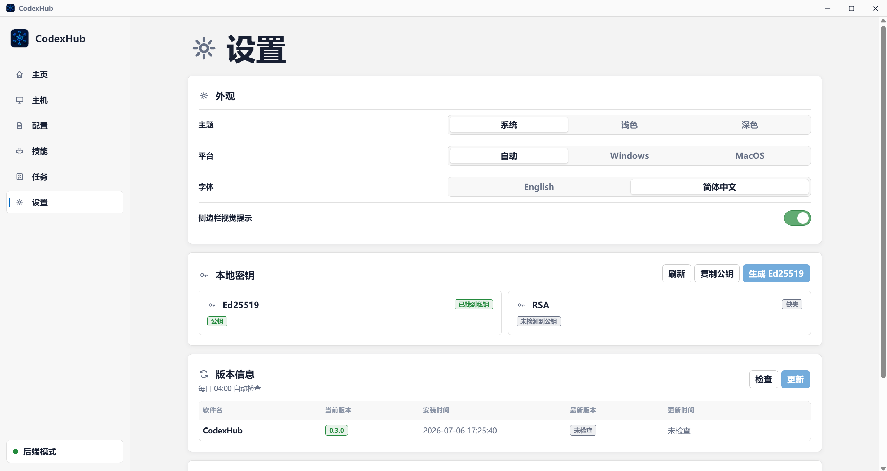 | 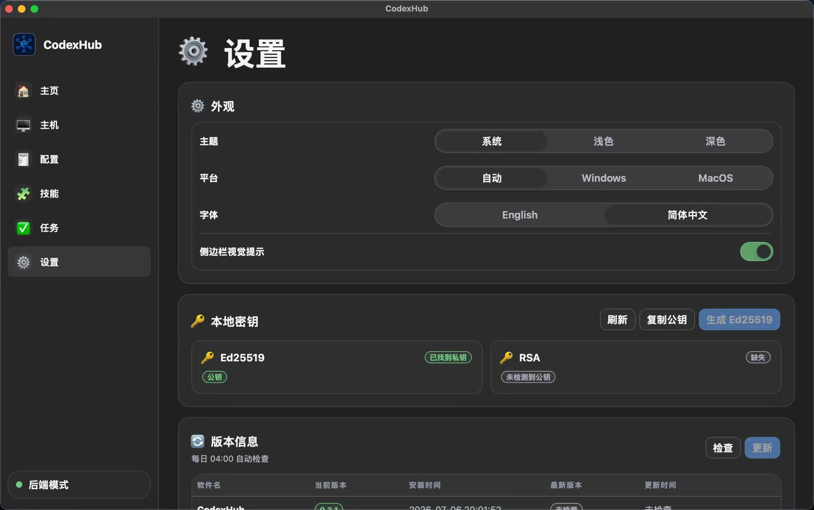 |

## ✨ 核心能力

- 检测 Windows、macOS 和 Linux 的本地 OpenSSH、本地公钥和 SSH config 状态。
- 在没有合适密钥时生成不覆盖旧文件的 Ed25519 key。
- 只读导入本地 SSH config 中安全的 Host alias（Windows 为 `%USERPROFILE%\.ssh\config`，macOS/Linux 为 `~/.ssh/config`）。
- 只写入 CodexHub 托管的 SSH config block，并在写入前备份。
- 通过 `ssh <HostAlias> echo ok` 测试连接。
- 探测远端 Linux 主机的系统、架构、shell、PATH、Codex CLI、`~/.codex/config.toml` 和 skills 数量。
- 在远端用户目录安装或更新 `codex` 命令；应用 profile 时可安装同名托管启动器，用来加载受管 env 后再执行真实 Codex。
- 创建、预览、应用 profile 到远端 `~/.codex/config.toml`。
- 导入本地或 GitHub skill，并安装到本机或远端目标。
- 对已记住主机展示只读、页面活跃时刷新的 CPU、内存和 GPU 资源采样。
- 最近 100 条任务记录会跨重启持久保存；每条保留任务的完整诊断信息统一放在“任务”页面，命令与 stdout/stderr 默认脱敏。
- 弹窗支持键盘焦点锁定、Esc 关闭、关闭后焦点恢复、范围明确的状态播报和 reduced-motion。
- 提供 Windows 托盘 / macOS 菜单栏 / Linux 托盘状态图标；首次点击窗口关闭按钮时会询问以后是退出程序还是最小化到托盘，后续可在 Settings 修改。
- 完成准备后，引导用户到 Codex App 手动添加或启用已验证的 SSH alias。

## 🔐 安全边界

- 不读取或显示 SSH 私钥，也不在 app 明文文件中保存 SSH 私钥、passphrase、一次性密码或 OpenAI API key。
- 一次性密码和已存储 API key 仅在用户主动点击后临时显示，便于核对或复制；不会写入浏览器存储或 task log。
- 对 SSH key 材料，UI 只返回和复制 public key。
- 不修改非 CodexHub 托管的 SSH config 内容。
- 托管 Host block 使用 `# >>> CodexHub managed host: <alias>` 和 `# <<< CodexHub managed host: <alias>` 标记。
- 不写 Codex App 私有文件、数据库、socket、缓存或未公开 IPC。
- 远端 Codex 配置使用 `env_key` / `apiKeyEnvVar` 引用远端环境变量。
- 显式应用带有已保存 key 的 profile 时，CodexHub 只把真实 key 写入选中远端的 `~/.codex-hub/env`，不会写入远端 config、metadata 或 task log。

更多说明见：[安全策略](../../SECURITY.md)、[已知限制](../known-limitations.md)。

## ✅ 运行要求

Windows 桌面应用需要：

1. Windows 10/11。
2. Microsoft WebView2 Runtime。
3. Windows OpenSSH client：`ssh.exe`、`scp.exe`、`ssh-keygen.exe`。
4. 可通过 SSH 登录的 Linux 远端主机。

macOS 桌面应用需要：

1. Apple Silicon Mac；后续新的本地 `.app` / `.dmg` 构建请用真实 Mac 验证。
2. OpenSSH client tools 和 `ssh-keygen`。
3. 通过 OpenAI/Codex 官方指引安装 Codex CLI。
4. 可通过 SSH 登录的 Linux 远端主机。

Linux 桌面应用需要：

1. Ubuntu/Debian x86_64 或 arm64。
2. OpenSSH client tools 和 `ssh-keygen`。
3. 通过 OpenAI/Codex 官方指引安装 Codex CLI。
4. 可通过 SSH 登录的 Linux 远端主机。

## 🚀 安装

日常使用建议从本仓库的 Releases 页面下载最新 stable 构建。

- Windows：下载并运行 `CodexHub_0.4.5_x64-setup.exe`。
- macOS Apple Silicon：下载 `CodexHub_0.4.5_aarch64.dmg`，打开后将 `CodexHub.app` 移入 Applications。v0.4.5 macOS 资产仍为 unsigned/ad-hoc；首次打开时可能需要通过 Control-click > Open 或 Privacy & Security 手动允许。只信任从本仓库 Release 页面下载的文件。
- `.app.tar.gz` 资产用于应用内更新；macOS 用户日常安装请使用 `.dmg`，不要手动解压 updater archive。
- Linux Ubuntu/Debian x86_64：安装 `CodexHub_0.4.5_amd64.deb`。Linux 默认使用 macOS 风格界面，可在 Settings 切换；已验证的 Linux stable 构建会进入签名自动更新 feed。
- Linux Ubuntu/Debian arm64：安装 `CodexHub_0.4.5_arm64.deb`。已验证的 Linux stable 构建会进入签名自动更新 feed。
- 如果 Settings 中检查更新失败，CodexHub 会弹出日志窗口，并把本次运行记录到 Tasks，方便后续回看。

## ⚡ 快速开始

1. 打开 CodexHub。
2. 在 Settings 检查 Local SSH。
3. 没有 key 时生成 Ed25519 key；已有 key 时不要覆盖。
4. 添加 SSH host，填写 host、user、port 和 identity file。
5. 对尚未配置公钥登录的远端，使用一次性密码引导。
6. 测试 SSH alias，并探测远端主机。
7. 安装或更新远端 Codex CLI。
8. 创建 profile，先 preview，再 apply。
9. 导入 skill，并安装到本机或远端。
10. 打开 Tasks 查看脱敏日志。
11. 到 Codex App `Settings > Codex > Connections` 添加或启用该 SSH alias。

## 📘 使用流程

### 添加主机

- 使用 Hosts > Add Server 创建新的 CodexHub 托管 alias。
- 现有 alias 可以从本地 SSH config 只读导入，不会重写非托管 block。
- 新托管主机只有在密码登录、公钥安装、权限修复和 key 登录验证成功后才写入。
- 首次 host key 使用 OpenSSH `StrictHostKeyChecking=accept-new`；host key 改变时仍会失败。

### 安装或更新 Codex

- 通过 Profiles 或 Dashboard 操作执行 `check-version`、`install` 或 `update`。
- 远端命令保持为 `codex`；应用 profile 时可安装 CodexHub 托管的 `~/.local/bin/codex` 启动器，先加载 `~/.codex-hub/env`，再执行真实 Codex。
- 安装目标为 `$HOME/.local/bin` 和 `$HOME/.codex`。
- PATH 修复会检查 `.bashrc` 或 `.zshrc`、`.profile`，以及已存在的 `.bash_profile` / `.zprofile`，并写入幂等的 CodexHub 托管 block。
- 优先尝试官方 installer；mirror 和本地上传 fallback 会记录到日志。

### 应用 Profile

- Profiles 渲染为 TOML。
- API key 使用环境变量引用；如果 profile 已保存本地 key，应用时会把真实值写入选中远端的 `~/.codex-hub/env` 并设置受限权限。
- 应用前先预览。
- 如果远端 config 已一致，CodexHub 报告 no changes，不创建备份。
- 如果文件发生变化，CodexHub 创建时间戳备份，并在 Tasks 中记录结果。

### 安装 Skills

- 可以导入包含 `SKILL.md` 的本地目录，也可以导入 GitHub 仓库/子目录 URL。
- CodexHub 会在 app config 目录保存一份托管本地副本。
- 目标检测使用缓存 inventory；给新主机安装前请先运行检测。
- 已安装 skill 标签可打开预览。下载会把该已安装目录导入本地技能库；卸载需要二次确认，并会永久删除当前目标上的该 skill 目录。
